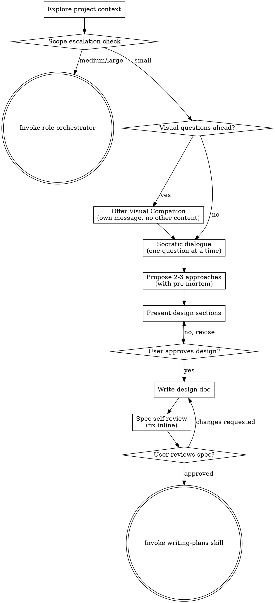

# Brainstorming Ideas Into Designs

Turn vague ideas into validated designs through structured dialogue,
before a single line of code exists.

**Core principle:** Design is not overhead — it is the fastest path to
correct implementation. Every hour of brainstorming saves ten hours of
rework.

**Violating the letter but not the spirit doesn't count.** Presenting a
"design" that's just a restatement of the user's request with
implementation steps tacked on is not brainstorming — it's performing
agreement. Real brainstorming challenges assumptions, surfaces hidden
requirements, and explores alternatives the user hasn't considered.

<HARD-GATE>
Do NOT invoke any implementation skill, write any code, scaffold any project,
or take any implementation action until you have presented a design and the
user has approved it. This applies to EVERY project regardless of perceived
simplicity.
</HARD-GATE>

**Announce at start:**
> "Activating brainstorming — I'll explore the idea with you before
> writing any code."

## When to Use

**Always:**
- New feature or capability
- Architecture or design changes
- Significant refactoring (touching 3+ files or changing interfaces)
- Workflow or process design
- Any task where the user's first message contains ambiguity

**Exceptions (brainstorming can be skipped):**
- Single-line bug fixes with obvious root cause
- Typo corrections, formatting changes
- Tasks where the user provides a complete, unambiguous spec
- The user explicitly says "skip brainstorming" or "just do it"

Thinking "this is too trivial to need a design"? That's exactly when
unexamined assumptions cause the most wasted work. The design can be
three sentences for a small task, but it MUST exist and be approved.

## Checklist

You MUST create a task for each of these items and complete them in order:

1. **Explore project context** — check files, docs, recent commits
2. **Scope escalation check** — assess if project needs role-orchestrator
3. **Offer visual companion** (if topic will involve visual questions) — this is its own message, not combined with a clarifying question
4. **Ask clarifying questions** — one at a time via Socratic dialogue
5. **Propose 2-3 approaches** — with trade-offs, pre-mortem, and your recommendation
6. **Present design** — in sections scaled to complexity, get user approval after each section
7. **Write design doc** — save to `docs/superpowers/specs/YYYY-MM-DD-<topic>-design.md` and commit
8. **Spec self-review** — inline check for placeholders, contradictions, ambiguity, scope
9. **User reviews written spec** — ask user to review before proceeding
10. **Transition to implementation** — invoke writing-plans skill

## Process Flow



**The terminal state is invoking writing-plans.** Do NOT invoke frontend-design, mcp-builder, or any other implementation skill. The ONLY skill you invoke after brainstorming is writing-plans.

## Workflow

### Phase 1: Understand Context

Before asking any questions, silently gather context:

- Read relevant files (README, CLAUDE.md, existing code in the area)
- Check recent git commits for related work
- Identify existing patterns, conventions, and constraints

Do NOT dump findings on the user. Use them to ask better questions.

**Scope decomposition:** Before asking detailed questions, assess scope:
if the request describes multiple independent subsystems (e.g., "build a
platform with chat, file storage, billing, and analytics"), flag this
immediately. Don't spend questions refining details of a project that
needs to be decomposed first. Help the user break it into sub-projects,
then brainstorm the first one through the normal flow.

### Phase 1.5: Scope Escalation Check

After gathering context, quickly assess project scale:
- **Multiple user roles or stakeholders** involved?
- **3+ services or major components** to coordinate?
- **Estimated effort > 2 weeks** or team size > 2 people?

If **2 or more** of these are true, the project is likely **medium or large**.
Suggest switching to `role-orchestrator`:

> "This looks like a medium/large-scale project — multiple components,
> significant scope. The `role-orchestrator` pipeline (PM → RD with
> structured artifacts and approval gates) would give you better
> requirements and design at this scale. Want to switch?"

If the user agrees, invoke `role-orchestrator` and stop brainstorming.
If the user declines, continue with brainstorming as normal.

**Skip this check if** the user explicitly asked for brainstorming or
the task is clearly a single-feature addition within an existing project.

### Phase 2: Visual Companion Offer

When you anticipate that upcoming questions will involve visual content
(mockups, layouts, diagrams), offer it once for consent:

> "Some of what we're working on might be easier to explain if I can
> show it to you in a web browser. I can put together mockups, diagrams,
> comparisons, and other visuals as we go. This feature is still new and
> can be token-intensive. Want to try it? (Requires opening a local URL)"

**This offer MUST be its own message.** Do not combine it with clarifying
questions, context summaries, or any other content. Wait for response.
If they decline, proceed with text-only brainstorming.

If they agree, read the detailed guide: `skills/brainstorming/visual-companion.md`

**Skip this phase** if the topic is purely non-visual (API design,
data modeling, backend logic, CLI tools).

### Phase 3: Socratic Dialogue

Ask questions **one at a time**. After each answer, ask the next
question informed by the response.

**Question strategy:**
1. **Purpose** — "What problem does this solve?" / "Who is this for?"
2. **Scope** — "What's in scope? What's explicitly out of scope?"
3. **Constraints** — "Any technical constraints, deadlines, or
   dependencies?"
4. **Success criteria** — "How will we know this works correctly?"
5. **Edge cases** — "What happens when X fails / is empty / is huge?"

**Default to structured select options (2-4 choices)** whenever you can
anticipate the likely answers. Select options have lower answer cost
than open-ended prose — the user can tap instead of type. Reserve
open-ended format only when you genuinely cannot predict the answer
space (e.g., "what specific problem triggered this?").

**Spoiler preview:** If the user's idea has an obvious issue you'll need
to address later, hint at it in your first question rather than
surprising them after 5 rounds of Q&A:
> "Let me ask a few questions first. (Heads up: the caching approach
> might have a consistency trade-off we'll need to address.)"

**Stop asking when:** you can describe the solution back to the user and
they agree you understand it. Don't over-interview — 3-5 questions is
typical.

### Phase 4: Explore Approaches

Propose **2-3 approaches** with trade-offs:

```
## Approach A: [Name] (Recommended)
- **How:** [Brief description]
- **Pros:** [Why this is recommended]
- **Cons:** [Honest downsides]
- **Effort:** [Relative estimate: small / medium / large]

## Approach B: [Name]
- **How:** [Brief description]
- **Pros:** [Advantages over A]
- **Cons:** [Why A is still preferred]
- **Effort:** [Relative estimate]

## Approach C: [Name] (if applicable)
- ...
```

**Lead with your recommendation** and explain why. Don't present options
as equally valid if they aren't.

**Pre-mortem check:** After drafting approaches, apply failure-first
thinking to each:

> "Assume this approach ships and fails catastrophically in 12 months.
> What is the most likely cause of failure?"

Add the top failure scenario to each approach's **Cons**. This is not
a full risk assessment — it's a 2-minute gut check that surfaces the
#1 thing that could go wrong. If the failure scenario is serious enough
to change the recommendation, say so.

**REQUIRED:** When approaches involve technical decisions (choice of
library, architecture pattern, protocol, data store, or any component
the team hasn't used before), you MUST invoke `tech-feasibility` to
evaluate the candidates before presenting them. When approaches depend
on factual claims about performance, scalability, or compatibility, you
MUST invoke `critical-research` to verify those claims. Do not present
unverified technical opinions as trade-off analysis.

### Phase 5: Present Design

Present the design in sections **scaled to complexity**. A single-file
task might need only "What we're building" and "How it works". A
multi-component task needs all sections.

After **each section**, ask: "Does this look right so far?"

Sections (use as needed):
1. **What we're building** — one-paragraph summary
2. **Architecture / Components** — how pieces fit together
3. **Data flow** — inputs, transformations, outputs
4. **API / Interface** — what the user or other code interacts with
5. **Error handling** — what can go wrong, how we handle it
6. **Testing strategy** — what tests prove this works
7. **Out of scope** — what we're explicitly NOT doing (YAGNI)

**Design for isolation and clarity:**

- Break the system into smaller units that each have one clear purpose,
  communicate through well-defined interfaces, and can be understood and
  tested independently
- For each unit, answer: what does it do, how do you use it, what does
  it depend on?
- Can someone understand what a unit does without reading its internals?
  Can you change the internals without breaking consumers? If not, the
  boundaries need work.

**Working in existing codebases:**

- Explore the current structure before proposing changes. Follow existing patterns.
- Where existing code has problems that affect the work, include targeted
  improvements as part of the design — don't propose unrelated refactoring.

### Phase 6: Document and Transition

After user approval:

1. **Write design doc** to `docs/superpowers/specs/YYYY-MM-DD-<topic>-design.md`
   (User preferences for spec location override this default)
2. **Commit** the design doc with message:
   `docs(specs): add <topic> design`

**Spec Self-Review:**
After writing the spec, look at it with fresh eyes:
1. **Placeholder scan:** Any "TBD", "TODO", incomplete sections? Fix them.
2. **Internal consistency:** Do any sections contradict each other?
3. **Scope check:** Focused enough for a single plan, or needs decomposition?
4. **Ambiguity check:** Could any requirement be interpreted two ways? Pick one.

Fix issues inline. No need to re-review — just fix and move on.

**User Review Gate:**
After self-review, ask the user to review:

> "Spec written and committed to `<path>`. Please review it and let me
> know if you want to make any changes before we start writing out the
> implementation plan."

Wait for response. If they request changes, make them and re-run
self-review. Only proceed once user approves.

**Transition:**
- For multi-step tasks → invoke `superpowers:writing-plans`
- For trivial tasks (user approved a 3-sentence design) → proceed
  directly with user's permission

**The default next step is `superpowers:writing-plans`.** Only skip it when the
design is so small that a plan would be longer than the implementation.

## Rationalization Prevention

| Excuse | Reality |
|--------|---------|
| "The user already knows what they want" | Users know what they want at a high level. The details where bugs live are unexplored. |
| "This is just a small change" | Small changes with wrong assumptions waste more time than large well-designed features. |
| "I'll figure it out as I code" | That's called prototyping, not implementation. You'll throw it away. |
| "The user seems impatient" | Spending 2 minutes on design saves 20 minutes of wrong-direction coding. Users prefer this. |
| "I already know the best approach" | Then presenting it for approval takes 30 seconds. If you're right, no time lost. If wrong, disaster averted. |
| "EnterPlanMode covers this" | Planning is HOW to build. Brainstorming is WHAT to build and WHY. Different stages. |

## Red Flags — STOP

- You're writing code and realize you never brainstormed → **STOP.
  Revert. Brainstorm.**
- You presented "one approach" instead of 2-3 → go back and explore
  alternatives
- You asked 3+ questions in a single message → slow down, one at a time
- You're copy-pasting the user's request as the "design" → that's not
  design, that's transcription
- You skipped context gathering → you're guessing instead of designing

## Anti-patterns

Watch for these common traps and push back when you see them.

**"Just build it, I already know what I want."**
Maybe. But if you can describe your design in 30 seconds and get
approval, no time is lost. If you're wrong, disaster averted. Ask:
"Can you walk me through the happy path in one sentence?" — if
they can, the design is nearly done. If they can't, they need
brainstorming more than they think.

**"Can you add X, Y, and Z while you're at it?"**
Scope creep during clarification. The user's *original* request is the
real task; extras surfaced during Q&A are usually wishlist. Explicitly
separate them: "Let's nail down X first. Y and Z can be Phase 2 — or
they might not be needed at all."

**"Make it configurable / extensible / future-proof."**
Premature abstraction. Design for the task at hand. Configurability is
free to add later but expensive to remove. Ask: "What specific future
change are you anticipating?" If they can't name one, skip it.

**"Let's design the whole system before testing anything."**
Build the smallest working version first. Validate the core assumption,
then layer on complexity. Propose a single-path MVP even when the user
asks for the full system.

---

## Examples

### Example 1: Simple Feature

**User:** "Add a dark mode toggle to the settings page"

**WRONG:**
> "I'll add a dark mode toggle. Let me create the component..."
> (Skipped brainstorming entirely)

**RIGHT:**
> "Activating brainstorming — let me explore this before writing code."
> 1. Reads existing settings page, theme system, CSS architecture
> 2. "Is this a system-preference-aware toggle (follows OS setting) or a
>    manual override that persists across sessions?"
> 3. [User answers]
> 4. "Where should the preference be stored?
>    A) localStorage (simplest, no backend)
>    B) User profile API (syncs across devices)
>    C) CSS custom properties only (no persistence)"
> 5. [Presents 2 approaches with trade-offs, gets approval]
> 6. Writes 5-sentence design doc → invokes superpowers:writing-plans

### Example 2: Ambiguous Request

**User:** "Make the app faster"

**WRONG:**
> "Here are 3 approaches to improve performance:
>  1. Add caching  2. Optimize queries  3. Use CDN"
> (Jumped to solutions without understanding the problem)

**RIGHT:**
> "Activating brainstorming — 'faster' can mean many things."
> 1. "Which part feels slow? Initial load, navigation between pages,
>    or specific actions like search?"
> 2. [User: "Search is unbearable"]
> 3. Profiles search endpoint, reads query code
> 4. "Search takes 3.2s. The bottleneck is a full table scan on the
>    `products` table. Two approaches: ..."
> 5. Invokes tech-feasibility to evaluate indexing vs. search engine

## Constraints

- **One question per message** — never batch questions
- **Never skip for small tasks** — scale the design down, don't skip it
- **Never present a single approach** — minimum 2 options
- **Never proceed without explicit approval**
- **YAGNI ruthlessly** — remove speculative features from every design
- **Design docs are short** — shorter than the implementation they describe

## Error Handling

### User Abandons Mid-Session
- If the user changes topic or says "never mind", acknowledge and stop
  brainstorming cleanly — do not persist partial design docs
- If resuming later, re-read context from scratch rather than relying on
  stale prior dialogue

### Context Too Large for Single Session
- If the codebase area is too large to fully explore in Phase 1, focus
  on the entry points and interfaces most relevant to the user's idea
- Document known unknowns in the design doc's "Out of scope" section

### User Provides Contradictory Requirements
- Surface the contradiction explicitly: "You mentioned X, but also Y —
  these seem to conflict. Which takes priority?"
- Do not silently resolve contradictions by picking one side

### Sub-Skill Invocation Failures
- If `tech-feasibility` or `critical-research` cannot reach a
  conclusion, document the uncertainty in the approach trade-offs
- Present the uncertainty to the user rather than hiding it

---

## Security Considerations

### Design Document File Safety
- Validate the spec path exists before writing; create it if missing
- Sanitize `<topic>` in filenames — strip characters outside `[a-z0-9-]`
- Never include secrets, API keys, or credentials in design documents

### User Input in Design Documents
- Design docs may quote user requirements verbatim — escape any content
  that could be interpreted as markdown injection
- Do not embed executable code blocks from user input without review

### Scope Limitation
- This skill is read-heavy and write-light (one design doc)
- It does not execute code, install packages, or modify existing source files
- The only file mutation is creating `docs/superpowers/specs/*.md` and committing it

---

## Visual Companion

A browser-based companion for showing mockups, diagrams, and visual options
during brainstorming. Available as a tool — not a mode. Accepting the
companion means it's available for questions that benefit from visual
treatment; it does NOT mean every question goes through the browser.

**Per-question decision:** Even after the user accepts, decide FOR EACH
QUESTION whether to use the browser or the terminal. The test: **would the
user understand this better by seeing it than reading it?**

- **Use the browser** for content that IS visual — mockups, wireframes,
  layout comparisons, architecture diagrams, side-by-side visual designs
- **Use the terminal** for content that is text — requirements questions,
  conceptual choices, tradeoff lists, scope decisions

If the user agreed to the companion, read the detailed guide before proceeding:
`skills/brainstorming/visual-companion.md`

---

## Related Skills

- **role-orchestrator** — for medium/large projects, escalate to the
  PM → RD pipeline instead of brainstorming (see Phase 1.5)
- **superpowers:writing-plans** — the default downstream skill (design → plan)
- **tech-feasibility** — REQUIRED in Phase 4 for technical decisions
- **critical-research** — REQUIRED in Phase 4 for factual claims
- **assumption-extractor** — invoke after tech-feasibility to surface
  hidden assumptions in the proposed approaches
- **micro-poc-validator** — invoke after assumption-extractor to
  empirically test CRITICAL assumptions before committing to a design
- **research-cross-validator** — cross-validate key technical claims
- **research-synthesis** — invoke after Phase 4 when 2+ research skills
  were used, to reconcile findings before presenting design
- **tech-research-pipeline** — for high-stakes decisions, use the full
  pipeline instead of manually chaining research skills
- **deep-reading** — build domain understanding from existing documents
  before brainstorming a solution in that domain
- **superpowers:test-driven-development** — downstream of superpowers:writing-plans
