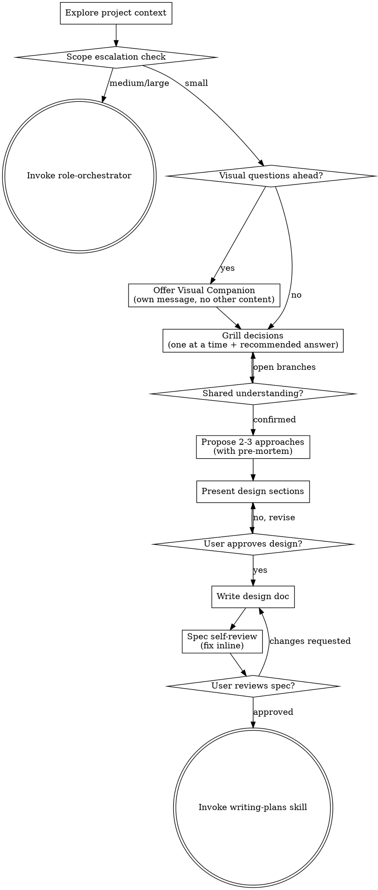

# Brainstorming Ideas Into Designs

Turn vague ideas into validated designs through structured dialogue,
before a single line of code exists.

**Core principle:** Do not advance because the conversation feels complete.
Advance only when the current phase's completion criterion is observable.

**Grilling is not optional.** Phase 3 relentlessly pressure-tests every
decision branch until shared understanding. Soft, agreement-seeking Q&A
is a failure mode — not brainstorming.

**Violating the letter but not the spirit doesn't count.** Presenting a
"design" that's just a restatement of the user's request with
implementation steps tacked on is not brainstorming — it's performing
agreement. Real brainstorming challenges assumptions, surfaces hidden
requirements, and explores alternatives the user hasn't considered.

<HARD-GATE>
Do NOT invoke any implementation skill, write any code, scaffold any project,
or take any implementation action until a design has been presented and
approved. This applies to EVERY project regardless of perceived simplicity.
</HARD-GATE>

## Context and Information Budget

- **Context load** is the instruction cost paid whenever this skill is loaded.
- **Cognitive load** is the effort required to find, interpret, and apply a
  rule; shorter is not automatically clearer if it hides a needed gate.
- **Progressive disclosure:** keep universal gates here; load branch-specific
  detail only when that branch is entered (for example, read
  `visual-companion.md` only after the user accepts the companion).
- Invoke related skills only when the current branch requires them. Before
  adding guidance, find its source of truth and prune duplicate, stale, or
  no-op rules; preserve changed behavior with a precise replacement or pointer.

**Announce at start:**
> "Activating brainstorming — I'll grill the decisions one at a time
> (with my recommended answer each round) before we lock a design or
> write any code."

## When to Use

**Always:**
- New feature or capability
- Architecture or design changes
- Significant refactoring (touching 3+ files or changing interfaces)
- Workflow or process design
- Any task where the user's first message contains ambiguity
- User wants to stress-test a plan/decision/idea ("grill", "烤",
  "stress-test", "challenge my plan", or similar)

**Exceptions (brainstorming can be skipped):**
- Single-line bug fixes with obvious root cause
- Typo corrections, formatting changes
- Tasks where the user provides a complete, unambiguous spec
- The user explicitly says "skip brainstorming" or "just do it"
  (these exceptions take priority over grilling — do not grill after
  an explicit skip)

Thinking "this is too trivial to need a design"? That's exactly when
unexamined assumptions cause the most wasted work. The design can be
three sentences for a small task, but it MUST exist and be approved.

## Checklist

Create a task for each of these items and complete them in order.
Keep a compact `Resolved`, `Open`, and `Next gate` record for each phase; do
not turn it into a transcript.

1. **Explore project context** — check files, docs, recent commits
2. **Scope escalation check** — assess if project needs role-orchestrator
3. **Offer visual companion** (if topic will involve visual questions) — this is its own message, not combined with a clarifying question
4. **Grill decisions** — one at a time, relentlessly, with a recommended answer each round, until shared understanding
5. **Propose 2-3 approaches** — with trade-offs, pre-mortem, and the recommendation
6. **Present design** — in sections scaled to complexity, get user approval after each section
7. **Write design doc** — save to `docs/superpowers/specs/YYYY-MM-DD-<topic>-design.md`; commit separately only with explicit approval
8. **Spec self-review** — inline check for placeholders, contradictions, ambiguity, scope
9. **User reviews written spec** — ask user to review before proceeding
10. **Transition to implementation** — invoke writing-plans skill

## Process Flow



**The terminal state is invoking writing-plans.** After brainstorming, invoke
only `writing-plans`; do NOT invoke frontend-design, mcp-builder, or another
implementation skill.

## Workflow

### Phase 1: Understand Context

Before asking any questions, silently gather context:

- Read relevant files (README, CLAUDE.md, existing code in the area)
- Check recent git commits for related work
- Identify existing patterns, conventions, and constraints

Do NOT dump findings on the user. Use them to ask better questions.

**Scope decomposition:** Before asking detailed questions, assess scope:
if the request describes multiple independent subsystems (e.g., "build a
platform with chat, file storage, billing, and analytics"), flag this
immediately. Don't spend questions refining details of a project that
needs to be decomposed first. Help the user break it into sub-projects,
then brainstorm the first one through the normal flow.

**Completion criterion:** Inspect relevant entry points, constraints, and
history; separate facts from decisions and queue or mark unknown facts
`NOT VERIFIED`.

### Phase 1.5: Scope Escalation Check

After gathering context, quickly assess project scale:
- **Multiple user roles or stakeholders** involved?
- **3+ services or major components** to coordinate?
- **Estimated effort > 2 weeks** or team size > 2 people?

If **2 or more** of these are true, the project is likely **medium or large**.
Suggest switching to `role-orchestrator`:

> "This looks like a medium/large-scale project — multiple components,
> significant scope. The `role-orchestrator` pipeline (PM → RD with
> structured artifacts and approval gates) would provide better
> requirements and design at this scale. Want to switch?"

If the user agrees, invoke `role-orchestrator` and stop brainstorming.
If the user declines, continue with brainstorming as normal.

**Skip this check if** the user explicitly asked for brainstorming or
the task is clearly a single-feature addition within an existing project.

**Completion criterion:** Record the scope classification and escalation
outcome, including why escalation was skipped when applicable.

### Phase 2: Visual Companion Offer

When upcoming questions are expected to involve visual content
(mockups, layouts, diagrams), offer it once for consent:

> "Some of what we're working on might be easier to explain with mockups,
> diagrams, comparisons, and other visuals in a web browser. This feature is
> still new and can be token-intensive. Want to try it? (Requires opening a
> local URL)"

**This offer MUST be its own message.** Do not combine it with clarifying
questions, context summaries, or any other content. Wait for response.
If they decline, proceed with text-only brainstorming.

If they agree, read the detailed guide: `skills/brainstorming/visual-companion.md`

**Skip this phase** if the topic is purely non-visual (API design,
data modeling, backend logic, CLI tools).

**Completion criterion:** Decide the visual need; if accepted, load its guide,
otherwise proceed text-only.

### Phase 3: Grill Decisions (relentless)

Interview relentlessly about every aspect of the idea until a **shared
understanding** is reached. Walk down each branch of the decision
tree, resolving dependencies between decisions one-by-one.

Ask questions **one at a time**. After each answer, ask the next
question informed by the response. Asking multiple questions at once is
bewildering — never batch.

**Fact vs decision (HARD):**
- If a *fact* can be found by exploring the environment (filesystem, git,
  docs, tools, runtime), look it up and attach the path or source — do **not**
  ask the user to supply it.
- If a fact cannot be verified, mark it `NOT VERIFIED` and carry it as an
  explicit assumption or blocker; never silently turn it into a decision.
- The *decisions* are the user's. Put each one to them and wait for their
  answer before continuing.

**Decision-tree discipline:**
- Order questions by dependency: close blocker decisions before
  dependent ones (e.g. "who is this for?" before "what auth model?").
- After each answer, update the frontier with the branch that closed, the
  branch that opens next, and the next question.
- Do not skip a branch because it feels awkward or the user seems sure —
  certainty without interrogation leaves failure modes undiscovered.

**Decision frontier:** After each answer, update `Closed` (user-confirmed
decisions), `Open` (design-changing branches), `Facts to verify` (a source or
`NOT VERIFIED` status), and `Assumptions` (facts the user agrees to carry).
Ask the highest-impact open decision next. An empty fact list does not prove
that all decisions are closed.

**Recommended answer on EVERY decision question (HARD):**
- For each decision, state the recommended answer *in the same message*
  as the question (or mark the recommended select option).
- Keep the recommendation brief and opinionated. Do not hide behind
  "it depends" unless the single fact that would change it is named.
- The user may reject the recommendation — that is fine. The point is
  to surface a concrete stance so they can agree or push back.

**Question strategy (cover each; order by dependency):**
1. **Purpose** — "What problem does this solve?" / "Who is the user?"
2. **Scope** — "What's in scope? What's explicitly out of scope?"
3. **Constraints** — "Any technical constraints, deadlines, or
   dependencies?"
4. **Success criteria** — "How will we know this works correctly?"
5. **Edge cases** — "What happens when X fails / is empty / is huge?"
6. **Load-bearing assumptions** — anything the design collapses without;
   grill these until explicit

**Default to structured select options (2-4 choices)** whenever the answer
space is predictable. Mark the recommended option. Select options have lower
answer cost than open-ended prose. Reserve open-ended format for cases where
the answer space cannot be predicted (e.g., "what specific problem
triggered this?") — and still give the recommendation in one sentence.

**Spoiler preview:** If the idea has an obvious issue requiring later
attention, hint at it in the first question rather than
surprising them after many rounds of Q&A:
> "Let me grill a few decisions first. (Heads up: the caching approach
> might have a consistency trade-off we'll need to address.)"

**Stop asking only when shared understanding is explicit:**
- The problem, constraints, and key decisions can be described back to the
  user.
- They confirm that description is correct.
- No open decision-tree branches remain that would change the design.
- Do **not** stop early just because 3–5 questions have passed. Keep
  grilling while open branches remain. Do not over-interview *closed*
  branches — once a decision is locked, move on.

**Gate before Phase 4:**
Confirm shared understanding in one short message, then wait:
> "Shared understanding check — we agree on: [X], [Y], [Z]. Any open
> branch I missed, or shall I propose approaches?"

Do **not** propose approaches, write a design, or take any
implementation action until they confirm. If they name an open branch,
resume grilling that branch first.

**Completion criterion:** The user confirms the shared understanding, `Open`
contains no design-changing branch, and every unresolved fact is resolved or
explicitly accepted as a `NOT VERIFIED` assumption.

### Phase 4: Explore Approaches

Propose **2-3 approaches** with trade-offs:

```
## Approach A: [Name] (Recommended)
- **How:** [Brief description]
- **Pros:** [Why this is recommended]
- **Cons:** [Honest downsides]
- **Effort:** [Relative estimate: small / medium / large]

## Approach B: [Name]
- **How:** [Brief description]
- **Pros:** [Advantages over A]
- **Cons:** [Why A is still preferred]
- **Effort:** [Relative estimate]

## Approach C: [Name] (if applicable)
- ...
```

**Lead with the recommendation** and explain why. Don't present options
as equally valid if they aren't.

**Pre-mortem check:** After drafting approaches, apply failure-first
thinking to each:

> "Assume this approach ships and fails catastrophically in 12 months.
> What is the most likely cause of failure?"

Add the top failure scenario to each approach's **Cons**. This is not
a full risk assessment — it's a 2-minute gut check that surfaces the
#1 thing that could go wrong. If the failure scenario is serious enough
to change the recommendation, say so.

**REQUIRED:** When approaches involve technical decisions (choice of
library, architecture pattern, protocol, data store, or any component
the team hasn't used before), MUST invoke `tech-feasibility` to
evaluate the candidates before presenting them. When approaches depend
on factual claims about performance, scalability, or compatibility, MUST
invoke `critical-research` to verify those claims. Do not present
unverified technical opinions as trade-off analysis.

**Completion criterion:** Each approach has a mechanism, trade-offs, effort,
and pre-mortem; verify technical claims or label them uncertain.

### Phase 5: Present Design

Present the design in sections **scaled to complexity**. A single-file
task might need only "What we're building" and "How it works". A
multi-component task needs all sections.

After **each section**, ask: "Does this look right so far?"

Sections (use as needed):
1. **What we're building** — one-paragraph summary
2. **Architecture / Components** — how pieces fit together
3. **Data flow** — inputs, transformations, outputs
4. **API / Interface** — what the user or other code interacts with
5. **Error handling** — what can go wrong, how we handle it
6. **Testing strategy** — what tests prove this works
7. **Out of scope** — what we're explicitly NOT doing (YAGNI)

**Design for isolation and clarity:**

- Break the system into smaller units that each have one clear purpose,
  communicate through well-defined interfaces, and can be understood and
  tested independently
- For each unit, answer: what does it do, how is it used, what does
  it depend on?
- Can someone understand what a unit does without reading its internals? Can
  its internals change without breaking consumers? If not, the
  boundaries need work.

**Working in existing codebases:**

- Explore the current structure before proposing changes. Follow existing patterns.
- Where existing code has problems that affect the work, include targeted
  improvements as part of the design — don't propose unrelated refactoring.

**Completion criterion:** The user has reviewed each necessary section; the
design names out-of-scope boundaries and has no design-changing open branch.

### Phase 6: Document and Transition

After user approval:

1. **Write design doc** to `docs/superpowers/specs/YYYY-MM-DD-<topic>-design.md`
   (User preferences for spec location override this default)
2. **Self-review** the written document before asking for review.
3. **Show the path and change** and ask the user to review the document.
   Writing the document and committing it are separate actions.
4. **After the user approves the written spec**, invoke the next planning
   step. Do not stage or commit as part of this workflow.

Commit only after a separate, explicit user approval. If approved, use:
`docs(specs): add <topic> design`.

**Spec Self-Review:**
After writing the spec, look at it with fresh eyes:
1. **Placeholder scan:** Any "TBD", "TODO", incomplete sections? Fix them.
2. **Internal consistency:** Do any sections contradict each other?
3. **Scope check:** Focused enough for a single plan, or needs decomposition?
4. **Ambiguity check:** Could any requirement be interpreted two ways? Pick one.

Fix issues inline. No need to re-review — just fix and move on.

**User Review Gate:**
After self-review, ask the user to review:

> "Spec written at `<path>` and not committed yet. Please review it and
> report any changes before we start writing the
> implementation plan."

Wait for response. If they request changes, make them and re-run
self-review. Only proceed once user approves.

**Transition:**
- For multi-step tasks → invoke `superpowers:writing-plans`
- For trivial tasks (user approved a 3-sentence design) → proceed
  directly with user's permission

**Completion criterion:** The spec exists, passed self-review, and its review
and commit status are reported separately; transition only after the written
spec is approved.

Keep the spec shorter than the implementation it describes; split the work if
that cannot be true.

**The default next step is `superpowers:writing-plans`.** Only skip it when the
design is so small that a plan would be longer than the implementation.

## Anti-patterns

Watch for these common traps and push back when they appear.

**"Just build it, I already know what I want."**
Maybe. If the design can be described in 30 seconds and get approval, no
time is lost. If the assumption is wrong, disaster is averted. Ask:
"Can the happy path be stated in one sentence?" — if so, the design is
nearly done. If not, more brainstorming is needed. Either way, still grill
the load-bearing decisions with recommended answers.

**"Also add X, Y, and Z while working on it?"**
Scope creep during clarification. The user's *original* request is the
real task; extras surfaced during Q&A are usually wishlist. Explicitly
separate them: "Let's nail down X first. Y and Z can be Phase 2 — or
they might not be needed at all."

**"Make it configurable / extensible / future-proof."**
Premature abstraction. Design for the task at hand. Configurability is
free to add later but expensive to remove. Ask: "What specific future
change is anticipated?" If none can be named, skip it. Recommend against
premature configurability unless the change is concrete.

**"Let's design the whole system before testing anything."**
Build the smallest working version first. Validate the core assumption,
then layer on complexity. Propose a single-path MVP even when the user
asks for the full system.

**"Just ask neutrally — don't bias me with a recommendation."**
A recommendation is a stake in the ground, not a command. Soft
neutrality wastes rounds. State the pick; let the user override it.

---

## Examples

### Example 1: Simple Feature

**User:** "Add a dark mode toggle to the settings page"

**WRONG:**
> "I'll add a dark mode toggle. Let me create the component..."
> (Skipped brainstorming entirely)

**RIGHT:**
> "Activating brainstorming — I'll grill decisions one at a time before
> we lock a design."
> 1. Reads existing settings page, theme system, CSS architecture
> 2. "Is this a system-preference-aware toggle (follows OS) or a manual
>    override that persists across sessions?
>    **Recommended: manual override that persists** — users who hunt for
>    a toggle usually want control, not OS mirroring alone.
>    A) System-preference-aware  B) Manual override (recommended)  C) Both"
> 3. [User answers]
> 4. "Where should the preference be stored?
>    **Recommended: A** for an MVP settings page with no cross-device need.
>    A) localStorage (recommended)  B) User profile API  C) CSS only"
> 5. Shared understanding check → user confirms
> 6. [Presents 2 approaches with trade-offs, gets approval]
> 7. Writes and self-reviews the 5-sentence design doc, gets spec approval,
>    then invokes superpowers:writing-plans; commit remains a separate gate

### Example 2: Ambiguous Request

**User:** "Make the app faster"

**WRONG:**
> "Here are 3 approaches to improve performance:
>  1. Add caching  2. Optimize queries  3. Use CDN"
> (Jumped to solutions without understanding the problem)

**RIGHT:**
> "Activating brainstorming — 'faster' can mean many things. Grilling
> the decision tree before approaches."
> 1. "Which user-visible operation misses its latency target?
>    **Recommended: measure before guessing —
>    start by naming the user-visible symptom.**
>    A) Initial load  B) Navigation  C) Specific actions like search"
> 2. [User: "Search is unbearable"]
> 3. Profiles search endpoint, reads query code (fact lookup — does not
>    ask the user what the bottleneck is)
> 4. Shared understanding check on symptom + measured bottleneck
> 5. Invokes tech-feasibility to evaluate indexing vs. search engine
> 6. Proposes approaches with trade-offs

## Error Handling

### User Abandons Mid-Session
- If the user changes topic or says "never mind", acknowledge and stop
  brainstorming cleanly — do not persist partial design docs
- If resuming later, re-read context from scratch rather than relying on
  stale prior dialogue

### Context Too Large for Single Session
- If the codebase area is too large to fully explore in Phase 1, focus
  on the entry points and interfaces most relevant to the user's idea
- Document known unknowns in the design doc's "Out of scope" section

### User Provides Contradictory Requirements
- Surface the contradiction explicitly: "X was mentioned, but Y also
  appears required — these seem to conflict. Which takes priority?"
  Include the recommended priority in the same message.
- Do not silently resolve contradictions by picking one side

### User Asks to Stop Grilling Mid-Phase
- If they say "enough questions" / "just propose approaches", give a
  one-line shared-understanding summary of what is locked vs still open
- Ask once: proceed with open branches as explicit assumptions, or keep
  grilling the open ones?
- Do not silently treat unconfirmed branches as decided
- If they choose to proceed with open branches as assumptions, still run
  the Phase 4 shared-understanding gate (list locked decisions + open
  assumptions) and wait for confirmation before proposing approaches

### Sub-Skill Invocation Failures
- If `tech-feasibility` or `critical-research` cannot reach a
  conclusion, document the uncertainty in the approach trade-offs
- Present the uncertainty to the user rather than hiding it

---

## Security Considerations

### Design Document File Safety
- Validate the spec path exists before writing; create it if missing
- Sanitize `<topic>` in filenames — strip characters outside `[a-z0-9-]`
- Never include secrets, API keys, or credentials in design documents

### User Input in Design Documents
- Design docs may quote user requirements verbatim — escape any content
  that could be interpreted as markdown injection
- Do not embed executable code blocks from user input without review

### Scope Limitation
- This skill is read-heavy and write-light (one design doc)
- It does not execute code, install packages, or modify existing source files
- Its file mutation is creating `docs/superpowers/specs/*.md`; a Git commit is
  optional and requires a separate explicit approval

---

## Visual Companion

A browser-based companion for showing mockups, diagrams, and visual options
during brainstorming. Available as a tool — not a mode. Accepting the
companion means it's available for questions that benefit from visual
treatment; it does NOT mean every question goes through the browser.

**Per-question decision:** Even after the user accepts, decide FOR EACH
QUESTION whether to use the browser or the terminal. The test: **would the
user understand this better by seeing it than reading it?**

- **Use the browser** for content that IS visual — mockups, wireframes,
  layout comparisons, architecture diagrams, side-by-side visual designs
- **Use the terminal** for content that is text — requirements questions,
  conceptual choices, tradeoff lists, scope decisions

If the user agreed to the companion, read the detailed guide before proceeding:
`skills/brainstorming/visual-companion.md`

---

## Related Skills

- **role-orchestrator** — for medium/large projects, escalate to the
  PM → RD pipeline instead of brainstorming (see Phase 1.5)
- **superpowers:writing-plans** — the default downstream skill (design → plan)
- **tech-feasibility** — REQUIRED in Phase 4 for technical decisions
- **critical-research** — REQUIRED in Phase 4 for factual claims
- **assumption-extractor** — invoke after tech-feasibility to surface
  hidden assumptions in the proposed approaches
- **micro-poc-validator** — invoke after assumption-extractor to
  empirically test CRITICAL assumptions before committing to a design
- **research-cross-validator** — cross-validate key technical claims
- **research-synthesis** — invoke after Phase 4 when 2+ research skills
  were used, to reconcile findings before presenting design
- **tech-research-pipeline** — for high-stakes decisions, use the full
  pipeline instead of manually chaining research skills
- **deep-reading** — build domain understanding from existing documents
  before brainstorming a solution in that domain
- **superpowers:test-driven-development** — downstream of superpowers:writing-plans

Grilling is built into Phase 3 of this skill — do **not** look for or
create a separate `grilling` skill. Triggers like "grill" / "烤" /
"stress-test" route here.
