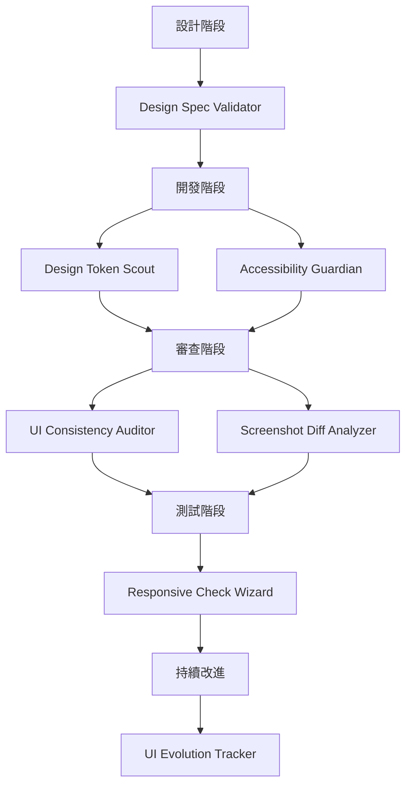

# ⏺ UI/UX Agent Skills 架構方案

## 一、 UI/UX Agent Skill 願景概述

### 當前挑戰
軟體工程師在實作 UI/UX 時常面臨：
*   **設計還原度不足**：與設計稿存在微妙但明顯的差異（間距、顏色、字體）。
*   **無障礙性被忽略**：趕工時容易忽略 a11y，上線後才發現問題。
*   **設計系統侵蝕**：硬編碼值逐漸蔓延，Design Token 形同虛設。
*   **跨裝置一致性**：responsive 實作有盲點，特定斷點出現 bug。
*   **缺乏設計驗證工具**：依賴手動對比，效率低且易遺漏。

### 願景：打造 UI/UX 的「持續驗證迴圈」
透過 Claude Code Agent Skills，建立一個從設計到代碼、從審查到部署的智慧驗證系統：



*(註：若無法渲染 Mermaid，流程為：設計階段 → Design Spec Validator → 開發階段 → (Token Scout + A11y Guardian) → 審查階段 → (Consistency Auditor + Screenshot Diff) → 測試階段 → Responsive Wizard → 持續改進 → UI Evolution Tracker)*

### 預期效益
*   ⚡ **效率**：減少 30-50% 的設計-開發往返時間
*   🎯 **品質**：提升 UI 還原度至 95% 以上
*   ♿ **合規**：自動化 80% 的 WCAG 基礎檢查
*   🔄 **維護**：保持 Design System 健康度

---

## 二、 核心 Skill 提案清單

### 1. Design Spec Validator（設計規範驗證器）

**定位**：「設計稿與實作的智慧對比引擎」

**功能**：
*   解析設計稿（Figma URL、截圖、設計規範文件）
*   掃描實作代碼（CSS/SCSS/Tailwind classes）
*   對比間距、字體、顏色、圓角、陰影等視覺屬性
*   生成差異報告與修復建議
*   支援多種設計工具（Figma API、截圖視覺分析）

**觸發場景**：
*   完成 UI 實作後，需驗證是否符合設計稿
*   Code Review 時檢查設計還原度
*   設計稿更新後，快速定位需調整的代碼

**開發者指令範例**：
> - Validate design spec for LoginPage component
> - Compare this implementation with Figma design
> - Check if my CSS matches the design tokens

**核心邏輯**：
1.  **輸入解析**：Figma URL (API) / 截圖 (Gemini Vision) / Design spec file
2.  **代碼掃描**：定位組件 → 提取樣式 (Inline/CSS Modules/Tailwind) → 建立屬性表
3.  **智慧對比**：比對數值差異 (e.g., 8px vs 10px, #3B82F6 vs #3B83F6)
4.  **生成報告**

**輸出範例**：
```markdown
## 設計驗證報告：LoginPage

### ✅ 符合規範 (12項)
- Primary button 顏色: #3B82F6 ✓
- Card border-radius: 8px ✓
...

### ⚠️ 偏差發現 (3項)
1. **Spacing 不一致** - `login-form.css:45`
   - 設計稿: margin-bottom: 16px
   - 實作: margin-bottom: 12px
   - 建議: 修改為 `mb-4` (16px)

2. **字體大小偏差** - `button.module.css:23`
   - 設計稿: font-size: 14px
   - 實作: font-size: 13px

### 💡 改進建議
- 使用 Design Token `--spacing-md` 取代硬編碼 16px
```

**技術實作關鍵**：
```bash
# 1. Figma API 整合
curl -H "X-Figma-Token: $FIGMA_TOKEN" "https://api.figma.com/v1/files/$FILE_KEY"

# 2. 視覺分析（截圖）
gemini -m gemini-3-flash vision \
  --image design.png \
  --prompt "Extract all spacing, colors, typography from this design"

# 3. CSS 屬性提取
grep -r "padding\|margin\|color\|font-size" src/components/
```

---

### 2. Accessibility Guardian（無障礙守護者）

**定位**：「WCAG 2.1 自動合規檢查員」

**功能**：
*   掃描 HTML/JSX 結構，檢查語義化標籤
*   驗證 color contrast ratio（WCAG AA/AAA）
*   檢查 ARIA attributes 正確性與 Image alt text
*   驗證鍵盤導航 (Keyboard navigation) 與 Focus states
*   分析 heading hierarchy 結構

**觸發場景**：Pre-commit 檢查、PR 審查、定期 a11y audit、上線前合規檢查。

**開發者指令範例**：
> Check accessibility for ProductCard component
> Run WCAG audit on my changes

**核心邏輯**：
1.  **靜態分析**：檢查語義化標籤、Alt text、ARIA 使用。
2.  **Color Contrast 計算**：提取背景/前景顏色計算比率 (4.5:1 AA)。
3.  **結構驗證**：Heading 層級、Interactive elements focus state。

**輸出範例**：
```markdown
## Accessibility Audit Report

### 📊 合規性評分
- WCAG 2.1 AA: 78/100 (需改進)

### 🔴 Critical Issues (2)
1. **Color contrast 不足** - `Button.tsx:23`
   - Current: 3.2:1 (#767676 on #FFFFFF)
   - Required: 4.5:1 (WCAG AA)
   - Suggestion: 使用 #5F5F5F 或更深顏色

2. **缺少鍵盤焦點樣式** - `Modal.tsx:89`
   - Suggestion: 添加 outline 或 ring

### 🟡 Important Issues (2)
3. 圖片缺少替代文字 - `ProductCard.tsx:15`
4. Heading 層級跳躍 - `Dashboard.tsx:34` (h2 -> h4)
```

**技術實作關鍵**：
```javascript
// Contrast checker example
const c1 = '$FG_COLOR';
const c2 = '$BG_COLOR';
const ratio = calculateContrast(c1, c2); // 需實作算法
console.log(ratio);
```

---

### 3. Design Token Scout（Design Token 偵察兵）

**定位**：「設計系統健康度監控專家」

**功能**：
*   掃描代碼中的硬編碼視覺值（Hardcoded values）
*   對比 Design Token 定義，識別「應使用 Token 但沒用」的情況
*   追蹤 Token 使用率與覆蓋度
*   檢測 Token 命名衝突

**觸發場景**：新增 UI 組件、Refactoring、定期技術債檢查。

**開發者指令範例**：
> Scan for hardcoded design values
> Check design token usage in this component
> Audit design system compliance

**核心邏輯**：
1.  **Token 定義偵測**：識別 `tokens.js`, `theme.ts`, `variables.css`。
2.  **硬編碼掃描**：`grep` 找出 hex colors, magic numbers (px)。
3.  **智慧對應**：使用 AI 將硬編碼值映射至最近似的 Token。

**輸出範例**：
```markdown
## Design Token 審計報告

### 📊 Token 使用率
- Overall compliance: 58% 🟡

### 🔍 發現的硬編碼值 (23處)
#### Colors
1. **`components/Button.tsx:34`**
   - Current: `background: "#3B82F6"`
   - Suggestion: `background: "var(--color-primary-500)"`

#### Spacing
2. **`components/Card.tsx:45`**
   - Current: `padding: "16px"`
   - Suggestion: `className="p-4"` (Tailwind)

### 💡 改進建議
- 替換 23 處硬編碼值為 tokens
- 刪除 7 個未使用的 tokens (--color-success-900...)
```

**技術實作關鍵**：
```bash
# 找出 CSS Variables
grep -rh "^  --" styles/tokens.css | sed 's/:.*$//'

# AI 匹配與建議
gemini "Match hardcoded value #3B82F6 to closest design token from: $TOKENS"
```

---

### 4. Responsive Check Wizard（響應式檢查精靈）

**定位**：「跨裝置佈局問題預警系統」

**功能**：
*   分析 CSS media queries 與 breakpoint 策略
*   檢測 overflow、layout shift、fixed positioning 問題
*   驗證 Mobile-first 實踐

**觸發場景**：新增複雜佈局、修改 Grid/Flex 邏輯、響應式驗證。

**開發者指令範例**：
> Check responsive behavior of ProductGrid
> Verify this component is mobile-friendly

**核心邏輯**：
1.  **Breakpoint 分析**：提取 media queries，對比標準斷點。
2.  **潛在問題偵測**：Fixed width > viewport, Fixed position on mobile。
3.  **Mobile-First 檢查**：計算 `min-width` vs `max-width` 使用比例。

**輸出範例**：
```markdown
## Responsive Analysis: ProductGrid

### ⚠️ Potential Issues (3)
1. **Horizontal overflow risk** - `grid.css:23`
   - `.product-grid { width: 1200px; }`
   - Suggestion: `width: 100%; max-width: 1200px;`

2. **Fixed positioning on mobile** - `header.css:45`
   - 建議增加 body padding 或使用 sticky。

3. **Missing mobile breakpoint**
   - Mobile (<640px) 仍顯示 2 欄，建議改為 1 欄。
```

---

### 5. UI Consistency Auditor（UI 一致性稽核員）

**定位**：「跨頁面設計一致性雷達」

**功能**：
*   掃描組件變體（Variants），檢測設計模式不一致（如 10 種按鈕樣式）
*   分析間距系統統一性（8px grid）
*   識別「孤兒組件」與「孤兒色」

**觸發場景**：多人協作、設計系統建立初期、Quarterly 設計債務清理。

**開發者指令範例**：
> Audit UI consistency across the app
> Find all button style variants

**輸出範例**：
```markdown
## UI Consistency Audit

### 🎨 設計模式統計
#### Buttons (8 variants found)
⚠️ **過多變體**：理想應為 2-4 種
1. **Primary Button** (15處) - ✓ 一致
2. **Small Button** (8處) - ⚠️ padding 不一致 (6px vs 8px)

#### Spacing System (87% compliant)
❌ Non-compliant: 12px (15處), 20px (8處) -> 建議改為 16px/24px

#### Color Palette
⚠️ 孤兒色: #8B5CF6 (僅用1次) -> 建議移除或整合
```

---

### 6. Screenshot Diff Analyzer（截圖差異分析器）

**定位**：「視覺回歸測試自動化專家」

**功能**：
*   比對「設計稿 vs 實作截圖」或「v1 vs v2」
*   使用 Gemini Vision 識別佈局、顏色、元素缺失
*   生成標註圖片與修復建議

**觸發場景**：Visual regression testing, Design handoff。

**開發者指令範例**：
> Compare design.png with implementation screenshot
> Check visual regression between v1 and v2

**核心邏輯**：
1.  **截圖獲取**：Playwright 自動截圖或手動上傳。
2.  **視覺分析**：Gemini Vision Prompt "Compare these two designs..."。
3.  **差異量化**：Pixelmatch (Optional) + AI 語意分析。

**輸出範例**：
```markdown
## Visual Comparison Report
### 🔍 發現的差異
1. **Header 高度不符**
   - 設計稿: 64px vs 實作: 80px
2. **Primary button 色偏**
   - 設計稿: #3B82F6 vs 實作: #60A5FA (較淺)
3. **缺少 divider line**
   - 建議添加 `border-b border-gray-200`
```

---

### 7. Component Style Linter（組件樣式檢查器）

**定位**：「React/Vue Component 的 UI 最佳實踐守護者」

**功能**：
*   檢查 Inline styles 濫用
*   識別過大的樣式文件 (>300 lines)
*   偵測未使用的樣式定義 (Unused CSS)

**觸發場景**：Code Review, Refactoring。

**輸出範例**：
```markdown
## Component Style Audit
1. **Excessive inline styles** - `Dashboard.tsx` (23 elements)
2. **Oversized style file** - `ProductPage.css` (487 lines)
3. **Unused classes** - `.old-button-style`
```

---

## 三、 技術實作架構建議

### 整體架構圖

```text
┌─────────────────────────────────────────────────┐
│         Claude Code + MCP Protocol              │
└─────────────────┬───────────────────────────────┘
                  │
        ┌─────────┴──────────┐
   ┌────▼────┐         ┌────▼─────┐
   │ Gemini  │         │ GitHub   │
   │   CLI   │         │   CLI    │
   └────┬────┘         └────┬─────┘
        │                   │
   ┌────▼─────────────────▼─────┐
   │   UI/UX Skills Framework    │
   │  ┌──────────────────────┐  │
   │  │  Visual Analysis     │  │  ← Gemini Vision
   │  │  (Screenshots)       │  │
   │  └──────────────────────┘  │
   │  ┌──────────────────────┐  │
   │  │  Static Code Scan    │  │  ← AST parsing
   │  │  (CSS/HTML/JSX)      │  │
   │  └──────────────────────┘  │
   │  ┌──────────────────────┐  │
   │  │  Design System Sync  │  │  ← Figma API
   │  │  (Tokens, Specs)     │  │
   │  └──────────────────────┘  │
   └─────────────────────────────┘
              │
        ┌─────▼──────┐
        │  Reports   │
        │  Fixes     │
        │  Metrics   │
        └────────────┘
```

### 技術堆疊選擇

| 功能 | 工具/技術 | 原因 |
| :--- | :--- | :--- |
| **視覺分析** | Gemini 3 Flash Vision | 多模態能力，理解截圖與設計稿 |
| **CSS 解析** | PostCSS / CSSTree | AST-based，精確提取屬性 |
| **HTML 分析** | Cheerio / JSDOM | DOM 解析，accessibility 檢查 |
| **Color analysis** | Chroma.js | Contrast ratio, color manipulation |
| **Design API** | Figma REST API | 自動同步設計規範 |
| **Screenshot** | Playwright | 自動截圖，支援多斷點 |
| **A11y audit** | axe-core, Pa11y | 業界標準工具 |

---

## 四、 落地實施路徑

### Phase 1: MVP（2-3 週）
*   **目標**：驗證可行性，建立基礎框架。
*   **內容**：
    *   ✅ **Design Token Scout** (靜態掃描，最易實作)
    *   ✅ **Accessibility Guardian** (基礎 Contrast & Alt check)
    *   ✅ **Screenshot Diff Analyzer** (手動截圖版)

### Phase 2: 增強功能（4-6 週）
*   **目標**：智慧化升級。
*   **內容**：
    *   ✅ **Design Spec Validator** (整合 Figma API)
    *   ✅ **Responsive Check Wizard** (Breakpoint 分析)
    *   ✅ **UI Consistency Auditor** (跨頁面分析)

### Phase 3: 自動化與整合（6-8 週）
*   **目標**：CI/CD Pipeline 整合。
*   **內容**：
    *   GitHub Actions 整合 (`ui-validation.yml`)。
    *   Playwright 自動化截圖。

---

## 五、 關鍵成功因素

1.  **上下文感知能力**
    *   自動偵測框架 (Tailwind, Styled-components, CSS modules)。
    *   自動發現 Design Token 文件位置。

2.  **非侵入性原則**
    *   建議而非強制。
    *   提供多種修復方案 (使用 Token / 使用 Utility class / 統一數值)。

3.  **視覺化輸出**
    *   提供 UI Quality Score 與趨勢圖。
    *   展示修復前後的 Code Diff 對比。

---

## 六、 創新性亮點

1.  **AI-Powered Design Suggestion**
    *   不只找錯，更主動建議 UX 改進（如：增強視覺層次、優化錯誤訊息位置）。
2.  **Design System Evolution Tracker**
    *   追蹤 Token 使用率隨時間的變化，識別 "Worst Offender" 組件。
3.  **Interactive Fix Workflow**
    *   CLI 互動式修復：`[f] Fix this [s] Skip [a] Fix all`。

---

## 七、 實作優先級建議

基於您作為主要 Code Reviewer 的角色，建議順序：

1.  🥇 **Phase 1 - 立即實作 (1-2週)**：**Design Token Scout + Accessibility Guardian**
    *   理由：靜態掃描實作快，立即能減少 Review 時間，建立品質基準。
2.  🥈 **Phase 2 - 短期目標 (3-4週)**：**Screenshot Diff Analyzer + UI Consistency Auditor**
    *   理由：針對大型專案維持視覺一致性，防止視覺回歸。
3.  🥉 **Phase 3 - 中期規劃**：Design Spec Validator + Responsive Wizard

---

## 八、 成本效益分析

### 時間節省估算（10人團隊）

| 狀態 | 每週花費 (小時) | 說明 |
| :--- | :--- | :--- |
| **Before Skills** | 20 hr | UI/UX 檢查 + 來回修正 |
| **After Skills** | 5.5 hr | 自動化檢查 + 聚焦邏輯 Review |
| **效益** | **節省 14.5 hr (72.5%)** | 相當於每週多出近 2 個工作天 |

### 開發成本估算

| Skill | 開發時間 | 技術難度 | 預期 ROI |
| :--- | :--- | :--- | :--- |
| Design Token Scout | 3-5 天 | ⭐⭐ | ⭐⭐⭐⭐⭐ |
| Accessibility Guardian | 4-6 天 | ⭐⭐⭐ | ⭐⭐⭐⭐⭐ |
| Screenshot Diff | 5-7 天 | ⭐⭐⭐⭐ | ⭐⭐⭐⭐ |
| Design Spec Validator | 8-10 天 | ⭐⭐⭐⭐⭐ | ⭐⭐⭐⭐ |

---

## 九、 差異化優勢

### vs 傳統 Linter (ESLint, Stylelint)
| 特性 | 傳統 Linter | UI/UX Agent Skills |
| :--- | :--- | :--- |
| **規則彈性** | 固定規則 | AI 理解上下文，動態判斷 |
| **視覺理解** | ✗ | ✓ (Gemini Vision) |
| **修復建議** | 簡單替換 | 多方案 + 解釋原因 |

### vs 手動設計 QA
| 特性 | 手動 QA | AI Automation |
| :--- | :--- | :--- |
| **速度** | 30 分鐘/頁面 | 2 分鐘/專案 |
| **一致性** | 依賴經驗 | 標準化檢查 |
| **覆蓋率** | 抽樣 | 100% 掃描 |

---

## 十、 實作範例：Design Token Scout

**檔案結構**
```text
design-token-scout/
├── SKILL.md
├── README.md
└── scripts/
    ├── scan_hardcoded.sh       # 主掃描腳本
    ├── extract_tokens.sh       # Token 提取
    └── match_suggest.sh        # AI 匹配建議
```

**核心腳本 (scan_hardcoded.sh)**
```bash
#!/bin/bash

# 1. 偵測框架與提取 Token
FRAMEWORK=$(detect_design_system)
TOKENS=$(extract_tokens "$FRAMEWORK")

# 2. 掃描硬編碼值 (Hex colors & Magic numbers)
HARDCODED=$(rg "#[0-9A-Fa-f]{6}|padding:|margin:" src/ --type tsx --type css -n)

# 3. AI 智慧匹配建議
gemini <<EOF
You are a Design System expert.
Available design tokens: $TOKENS
Found hardcoded values: $HARDCODED

For each hardcoded value, suggest:
1. The closest matching token
2. Refactor code example
Format output as structured JSON.
EOF
```

---

## 十一、 總結與建議

**立即行動項目**：
1.  更新 `SKILLS_ROADMAP.md`，加入 UI/UX Skills 專區。
2.  **本週優先實作 Design Token Scout (MVP)**。
3.  安裝基礎設施 (`axe-core`, `pa11y`, `jq`)。

**長期願景**：
建立 UI/UX Intelligence Platform，從單純的檢查工具進化為「AI Design Partner」，協助團隊不僅「發現問題」，更能「預測問題」並「主動優化」。

**準備好開始實作第一個 UI/UX Skill 了嗎？建議從 Design Token Scout 開始！ 🎨✨**