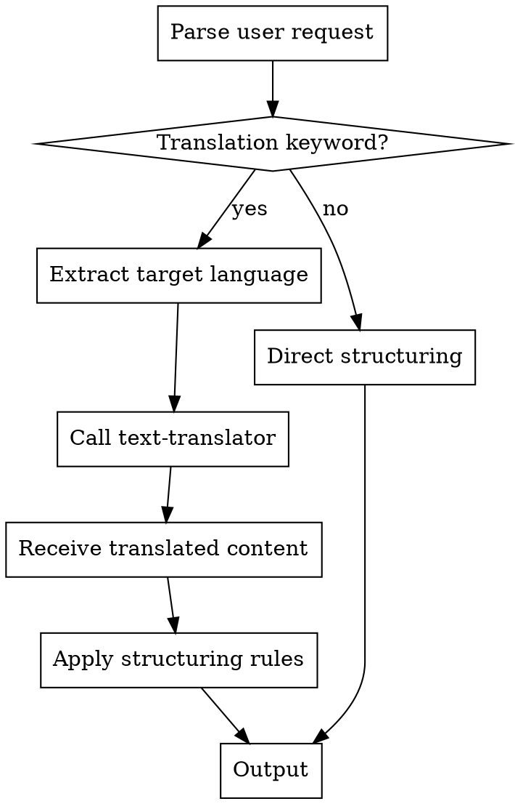

# Text-Translator Skill Implementation Plan

> **For Claude:** REQUIRED SUB-SKILL: Use superpowers:executing-plans to implement this plan task-by-task.

**Goal:** Create standalone text-translator skill that translates text content while preserving code and Markdown structure, with integration support for markdown-structurer.

**Architecture:** Simple translation skill with format detection (Markdown vs plain text), natural language parsing for target language, and preservation rules for code elements. No external dependencies, uses Claude's native translation capabilities.

**Tech Stack:**
- Claude Code (Read, Write, Edit, AskUserQuestion tools)
- No external dependencies
- YAML frontmatter
- Markdown parsing

**Design Doc:** `/Users/tom_wang/.claude/skills/docs/plans/2026-01-28-text-translator-design.md`

---

## Task 1: Create Basic Skill Structure

**Files:**
- Create: `text-translator/SKILL.md`

**Step 1: Create directory**

```bash
mkdir -p text-translator
```

**Step 2: Create SKILL.md with basic structure**

File: `text-translator/SKILL.md`

```markdown
---
name: text-translator
description: Translate text content to target language. For Markdown files, preserves structure and code. Triggers on "translate to", "翻譯成", "convert to". Supports any language Claude understands.
---

# Text Translator

## Overview

Translates text content to target language while intelligently preserving technical elements.

**Handles multiple formats:**
- **Plain text:** Direct translation
- **Markdown:** Preserves structure (headers, lists, tables) and code blocks
- **Other text files:** Full translation

**Core principle:** Translate content while preserving code and technical formatting.

## When to Use

**Use this skill when:**
- Need document in different language
- Working with multilingual documentation
- Preparing content for international audiences
- Converting notes to target language

**Do NOT use for:**
- Code-only files (no translation needed)
- Binary files
- Already in target language

## Language Detection

**From user request:**

Natural language keywords are parsed to detect target language:
- English: "English", "英文", "en", "in English", "translate to English"
- Traditional Chinese: "Traditional Chinese", "繁體中文", "繁中", "zh-TW"
- Japanese: "Japanese", "日文", "日本語", "ja"
- Korean: "Korean", "韓文", "한국어", "ko"
- Spanish: "Spanish", "西班牙文", "español", "es"
- French: "French", "法文", "français", "fr"
- German: "German", "德文", "Deutsch", "de"
- Others: Any language description Claude understands

**If not specified:**
- Ask user: "要翻譯成什麼語言？"
- Provide common options: (1) 英文 (2) 繁體中文 (3) 日本語 (4) 其他

**Confirmation:**
Before translating, confirm detected language:
```
"Translating to English..."
"翻譯成繁體中文中..."
"日本語に翻訳します..."
```

## Translation Rules

### Format Detection

**Automatic detection:**
- Check for Markdown markers (`#`, ` ``` `, `- `, `| |`)
- If Markdown detected → Apply Markdown preservation rules
- If no Markdown → Treat as plain text

### Plain Text Translation

**Rules:**
- Translate all content directly
- Preserve line breaks and paragraph structure
- No special handling needed

### Markdown Translation

**Element handling:**

| Element | Action | Example |
|---------|--------|---------|
| Headers (`#`, `##`, `###`) | Translate text | `## 技巧` → `## Techniques` |
| Paragraphs | Translate content | Full paragraph translation |
| Lists (`-`, `*`, `1.`) | Translate items | `- 使用動詞` → `- Use verbs` |
| Tables | Translate cell content | All cells translated |
| Bold/Italic (`**`, `*`) | Translate marked text | `**重要**` → `**Important**` |
| Links (`[text](url)`) | Translate text, preserve URL | `[文檔](url)` → `[Documentation](url)` |
| Code blocks (` ``` `) | **Preserve completely** | No changes to code |
| Inline code (`` ` ``) | **Preserve completely** | `` `variableName` `` unchanged |
| Blockquotes (`>`) | Translate content | `> 注意` → `> Note` |

### Technical Term Preservation

**Always preserve:**
- Common acronyms: API, HTTP, REST, CRUD, SQL, JSON, XML, HTML, CSS
- Proper nouns: GitHub, Claude, React, Python, JavaScript
- Programming keywords: function, class, return, import, export
- Technical commands: git, npm, bash, curl
- File extensions: .md, .py, .js, .json

**Translate:**
- Descriptive text and explanations
- General concepts (not technical jargon)
- User-facing content

**When uncertain:**
- Preserve technical terms by default (safer)
- Note: "Some technical terms preserved for accuracy"

## Workflow

### Step-by-Step

1. **Parse language intent**
   - Extract language keywords from user request
   - If unclear → Ask user with AskUserQuestion
   - Confirm target language to user

2. **Read content**
   - Use Read tool to load file
   - Or accept content directly from calling skill

3. **Detect format**
   - Check for Markdown markers
   - Set preservation rules accordingly

4. **Translate content**
   - Apply translation to appropriate elements
   - Preserve code blocks and inline code
   - Preserve technical terms
   - Maintain structure

5. **Output result**
   - Use Write or Edit tool (if file-based)
   - Or return translated content (if called by other skill)
   - Confirm completion to user

## Examples

### Example 1: Plain Text Translation

**Input:**
```
這是一段技術說明。我們使用 API 來處理 HTTP 請求。系統會返回 JSON 格式的回應。
```

**User request:**
```
"翻譯成英文"
```

**Output:**
```
This is a technical description. We use API to handle HTTP requests. The system returns JSON formatted responses.
```

**Note:** API, HTTP, JSON preserved as technical terms.

### Example 2: Markdown Translation

**Input:**
```markdown
## 安裝指南

使用以下指令安裝：

```bash
npm install package-name
```

常見問題：
- 確保 Node.js 已安裝
- 檢查網路連線
```

**User request:**
```
"translate to English"
```

**Output:**
```markdown
## Installation Guide

Install using the following command:

```bash
npm install package-name
```

Common issues:
- Ensure Node.js is installed
- Check network connection
```

**Note:** Code block completely preserved, Markdown structure maintained.

### Example 3: Technical Document Translation

**Input:**
```markdown
# API 使用說明

## 驗證方式

使用 OAuth 2.0 進行驗證。首先取得 access token：

```javascript
const token = await getAccessToken();
```

然後在 header 中加入 `Authorization: Bearer ${token}`。
```

**User request:**
```
"translate to Japanese"
```

**Output:**
```markdown
# API 使用説明

## 認証方法

OAuth 2.0 を使用して認証します。まず access token を取得します：

```javascript
const token = await getAccessToken();
```

その後、header に `Authorization: Bearer ${token}` を追加します。
```

**Note:** OAuth 2.0, access token, header, Authorization, Bearer preserved. Code blocks unchanged. Inline code preserved.

## Error Handling

### Language Detection Errors

**Unsupported or unclear language:**
- Error message: "無法確認翻譯目標語言。請明確指定語言，例如：英文、繁體中文、日文等。"
- Action: Ask user to specify language with AskUserQuestion

**No language specified:**
- Ask user: "要翻譯成什麼語言？
  (1) 英文 (English)
  (2) 繁體中文 (Traditional Chinese)
  (3) 日本語 (Japanese)
  (4) 한국어 (Korean)
  (5) 其他（請輸入語言名稱）"

### Content Processing Errors

**File not found:**
- Check file path is correct
- Error: "File not found at [path]. Please verify the path."

**Empty content:**
- Error: "Content is empty. Nothing to translate."

**Translation quality issues:**
- Complete translation anyway
- Add warning: "Note: Translation completed. Please review for technical accuracy."
- Suggest manual review for critical documents

**Mixed language detection:**
- Translate all text portions
- Note: "Detected mixed language content - translated all text portions"

**Format detection failure:**
- Fallback to plain text translation
- Note: "Processed as plain text"

### Graceful Degradation

**If translation partially fails:**
- Output what was successfully translated
- Mark untranslated sections with: `[Translation failed: original text]`
- Inform user: "Partial translation completed. Some sections could not be translated."

## Integration

### Called by Other Skills

**markdown-structurer integration:**

markdown-structurer can automatically call text-translator when it detects translation keywords:

```markdown
User: "翻譯成英文並結構化"

markdown-structurer:
1. Detects "翻譯" + "英文"
2. Calls text-translator(target=English, content=original)
3. Receives translated content
4. Applies structuring rules
5. Outputs structured English document
```

**Standalone usage:**

```markdown
User: "翻譯這份文件成英文"

text-translator:
1. Detects target=English
2. Reads file
3. Translates with Markdown preservation
4. Outputs translated file
```

### Return Format (for calling skills)

When called by other skills, return:
```
{
  "translated_content": "...",
  "source_language": "Traditional Chinese",
  "target_language": "English",
  "format": "markdown",
  "notes": ["Preserved 3 code blocks", "Preserved 12 technical terms"]
}
```

## Security Considerations

### Input Validation

- Validate file paths (no directory traversal)
- Check file size (max 10MB recommended)
- Sanitize user input in language requests

### Safe Operations

- Read-only by default
- Confirm before overwriting files
- Don't execute embedded code
- Validate file extensions

### Content Safety

- Don't translate credentials or secrets in code blocks
- Preserve security-sensitive code comments
- Don't alter security configurations

## Rationalization Table

| Excuse | Reality |
|--------|---------|
| "No language specified, so I'll use English" | Ask user to specify target language |
| "Code comments should be translated too" | Code blocks preserved completely, including comments |
| "Inline code is just text" | Inline code preserved - it's technical syntax |
| "Technical terms should be translated for clarity" | Preserve technical terms - they're standardized internationally |
| "User said translate, so translate everything" | Code and technical syntax always preserved |
| "Mixed languages are confusing, I'll pick one" | Translate all text, note mixed content to user |

## Common Mistakes

### ❌ Mistake 1: Translating code blocks

**Problem:** Translating code content breaks functionality.

**Bad example:**
```javascript
// Before
function getUserData() {
  return data;
}

// After (WRONG)
function 取得使用者資料() {
  return 資料;
}
```

**Fix:** Code blocks NEVER translated, regardless of language.

### ❌ Mistake 2: Translating inline code

**Problem:** Technical terms in inline code lose meaning.

**Bad example:**
```
Use `getUser` function → 使用 `取得使用者` 函式
```

**Fix:** Preserve inline code completely.

### ❌ Mistake 3: Translating technical acronyms

**Problem:** API, HTTP, REST are international standards.

**Bad example:**
```
Use the API → 使用應用程式介面
```

**Fix:** Preserve technical acronyms: "Use the API" → "使用 API"

### ❌ Mistake 4: Breaking Markdown structure

**Problem:** Changing Markdown syntax during translation.

**Bad example:**
```
## 標題 → ## Title (missing # count, wrong spacing)
- 項目 → * Item (changed list marker)
```

**Fix:** Preserve exact Markdown syntax, only translate text content.

### ❌ Mistake 5: Not asking for language

**Problem:** Assuming target language without confirmation.

**Fix:** Always ask if target language unclear from request.
```

**Step 3: Verify structure**

```bash
head -20 text-translator/SKILL.md
```

Expected: Valid YAML frontmatter, clear overview section

**Step 4: Commit**

```bash
git add text-translator/SKILL.md
git commit -m "feat(text-translator): create skill with core documentation

- Add YAML frontmatter with name and description
- Document translation rules for plain text and Markdown
- Define language detection and format detection logic
- Add examples for different translation scenarios
- Include error handling and security considerations"
```

---

## Task 2: Create README.md

**Files:**
- Create: `text-translator/README.md`

**Step 1: Create README.md**

File: `text-translator/README.md`

```markdown
# Text Translator

Translate text content to any target language while preserving code, structure, and technical formatting.

## Quick Start

**Trigger the skill:**
```
"翻譯成英文"
"translate to Japanese"
"用繁體中文翻譯這份文件"
```

**Example:**
```
User: "Translate this document to English"
Claude: [Applies text-translator skill]
        → Detects target: English
        → Reads content
        → Preserves code and Markdown structure
        → Translates text content
        → Outputs translated document
```

## Features

### Universal Text Translation
- **Plain text:** Direct translation
- **Markdown:** Structure and code preservation
- **Any language:** Leverages Claude's multilingual capabilities

### Smart Preservation
- Code blocks: Completely untouched
- Inline code: Technical syntax preserved
- Technical terms: API, HTTP, REST, etc. maintained
- Links: Text translated, URLs preserved

### Natural Language Interface
- Detect language from keywords (English, 英文, 日本語)
- Interactive clarification if unclear
- Confirmation before processing

## When to Use

**Use this skill when:**
- Need document in different language
- Creating multilingual documentation
- Translating technical content
- Preparing international content

**Works with:**
- Plain text files
- Markdown documents
- Technical documentation
- README files, specs, guides

## Translation Modes

### Plain Text
- All content translated
- Line breaks preserved
- Simple and direct

### Markdown (Smart Mode)
- Translates: Headers, paragraphs, lists, tables, quotes
- Preserves: Code blocks, inline code, URLs, file paths
- Maintains: Markdown structure and formatting

## Examples

### Plain Text

**Before:**
```
這是技術文件。使用 API 處理請求。
```

**After (English):**
```
This is technical documentation. Use API to handle requests.
```

### Markdown Document

**Before:**
```markdown
## 安裝

使用指令：

```bash
npm install
```

確保 Node.js 已安裝。
```

**After (English):**
```markdown
## Installation

Use the command:

```bash
npm install
```

Ensure Node.js is installed.
```

## Integration

### Standalone Usage
```
User: "翻譯這個文件成英文"
→ text-translator translates directly
```

### Called by markdown-structurer
```
User: "翻譯成英文並結構化"
→ markdown-structurer detects translation need
→ Calls text-translator automatically
→ Applies structuring to translated content
```

## Troubleshooting

### "Target language unclear"
- Specify language explicitly: "translate to English"
- Or respond to clarification question

### "Translation quality seems off"
- Review technical terms (may be over-preserved)
- Try rephrasing source content
- Manual review recommended for critical docs

### "Code was translated"
- Report as bug - code should never be translated
- Check if content was in code block format

## Dependencies

- **Required:** Claude Code Read, Write, Edit tools
- **Optional:** None
- **Works with:** markdown-structurer (auto-integration)

## Security

- Read-only by default
- Validates file paths
- No code execution
- Preserves security-sensitive content in code blocks

## Related Skills

- **markdown-structurer:** Calls translator when translation detected
- **markdown-formatter:** Can format before/after translation
- **spec-generator:** Can translate generated specs

## License

Part of Claude Code skills collection.
```

**Step 2: Commit**

```bash
git add text-translator/README.md
git commit -m "docs(text-translator): create README with quick start

- Add quick start guide and feature overview
- Document plain text and Markdown translation modes
- Provide examples and integration information
- Include troubleshooting and dependencies"
```

---

## Task 3: Create Translation Examples

**Files:**
- Create: `text-translator/examples/plain-text-example.md`
- Create: `text-translator/examples/markdown-example.md`
- Create: `text-translator/examples/README.md`

**Step 1: Create plain text example**

File: `text-translator/examples/plain-text-example.md`

```markdown
# Plain Text Translation Example

## Original (Traditional Chinese)

```
技術文件翻譯測試

這是一個簡單的技術說明文件。我們使用 REST API 來處理用戶請求。系統會返回 JSON 格式的回應資料。

主要功能包括：
用戶驗證、資料處理、錯誤處理。

注意事項：
確保所有 API 呼叫都包含正確的 authentication header。
```

## Translated (English)

**User request:** "translate to English"

**Result:**
```
Technical Document Translation Test

This is a simple technical description document. We use REST API to handle user requests. The system returns JSON formatted response data.

Main features include:
User authentication, data processing, error handling.

Notes:
Ensure all API calls include the correct authentication header.
```

## Key Points

- ✅ All text translated to English
- ✅ Technical terms preserved (REST API, JSON, API, authentication, header)
- ✅ Line breaks and structure maintained
- ✅ Natural flow in target language
```

**Step 2: Create Markdown example**

File: `text-translator/examples/markdown-example.md`

```markdown
# Markdown Translation Example

This example demonstrates translation while preserving Markdown structure and code.

## Original (Traditional Chinese)

```markdown
# API 使用指南

## 快速開始

首先安裝套件：

```bash
npm install api-client
```

然後初始化：

```javascript
const client = new APIClient({
  apiKey: 'your-key',
  baseURL: 'https://api.example.com'
});
```

## 主要功能

### 驗證

使用 `authenticate()` 方法進行驗證：

```javascript
await client.authenticate();
```

### 發送請求

| 方法 | 用途 | 回應格式 |
|------|------|---------|
| `get()` | 取得資料 | JSON |
| `post()` | 建立資料 | JSON |
| `delete()` | 刪除資料 | Status code |

## 注意事項

- 確保 API key 有效
- 所有請求使用 HTTPS
- 處理錯誤回應

> **重要：** 不要將 API key 提交到版本控制系統。
```

## Translated (English)

**User request:** "translate to English"

**Result:**

```markdown
# API Usage Guide

## Quick Start

First, install the package:

```bash
npm install api-client
```

Then initialize:

```javascript
const client = new APIClient({
  apiKey: 'your-key',
  baseURL: 'https://api.example.com'
});
```

## Main Features

### Authentication

Use the `authenticate()` method for authentication:

```javascript
await client.authenticate();
```

### Sending Requests

| Method | Purpose | Response Format |
|--------|---------|-----------------|
| `get()` | Retrieve data | JSON |
| `post()` | Create data | JSON |
| `delete()` | Delete data | Status code |

## Important Notes

- Ensure API key is valid
- All requests use HTTPS
- Handle error responses

> **Important:** Do not commit API key to version control system.
```

## Key Points

- ✅ All headers translated
- ✅ All paragraphs and list items translated
- ✅ Table content translated
- ✅ **Code blocks completely preserved** (bash, javascript)
- ✅ **Inline code preserved** (`authenticate()`, `get()`, etc.)
- ✅ Technical terms preserved (API, JSON, HTTPS, API key)
- ✅ Blockquote content translated
- ✅ Markdown structure maintained

## Preservation Details

**What was NOT translated:**
- Code blocks: 3 blocks (bash, 2x javascript)
- Inline code: `authenticate()`, `get()`, `post()`, `delete()`
- Technical terms: API, JSON, HTTPS, API key, Status code
- URLs: https://api.example.com
- Code variables: apiKey, baseURL, client

**What WAS translated:**
- Headers: "API 使用指南" → "API Usage Guide"
- Paragraphs: All descriptive text
- Lists: "確保 API key 有效" → "Ensure API key is valid"
- Tables: Headers and content
- Blockquotes: "重要：不要將..." → "Important: Do not commit..."
```

**Step 3: Create examples/README.md**

File: `text-translator/examples/README.md`

```markdown
# Examples

This directory demonstrates text-translator skill capabilities.

## Available Examples

### Plain Text Translation

**File:** `plain-text-example.md`

**Demonstrates:**
- Direct text translation
- Technical term preservation (API, JSON, HTTP)
- Structure maintenance

**Use case:** Translating notes, documentation without Markdown

### Markdown Translation

**File:** `markdown-example.md`

**Demonstrates:**
- Markdown structure preservation
- Code block protection (bash, javascript)
- Inline code preservation
- Table translation
- Technical term handling
- Blockquote translation

**Use case:** Translating technical documentation, README files, guides

## Quick Test

Try translating the examples yourself:

```bash
# Copy example to test file
cp plain-text-example.md test-translation.md

# Ask Claude
"Translate test-translation.md to English"
```

Compare result with the "Translated" section in the example.

## What Gets Preserved

**Always preserved:**
- Code blocks (bash, python, javascript, etc.)
- Inline code (`` `code` ``)
- Technical acronyms (API, HTTP, JSON, REST, etc.)
- Proper nouns (GitHub, React, Node.js)
- URLs and file paths
- Programming keywords

**Always translated:**
- Headers and titles
- Paragraph content
- List items
- Table content
- Link text
- Blockquote content
- General descriptions

## Real-World Scenarios

### Scenario 1: README Translation
- Original: Chinese README
- Need: English version for open source
- Use: text-translator → English
- Result: All docs translated, code examples preserved

### Scenario 2: Multilingual Documentation
- Original: English technical spec
- Need: Japanese version for team
- Use: text-translator → Japanese
- Result: Complete Japanese docs with original code

### Scenario 3: With Structuring
- Original: Unstructured Chinese notes
- Need: Structured English document
- Use: "翻譯成英文並結構化"
- Result: markdown-structurer calls translator, then structures
```

**Step 4: Commit**

```bash
git add text-translator/examples/plain-text-example.md \
        text-translator/examples/markdown-example.md \
        text-translator/examples/README.md
git commit -m "docs(text-translator): add translation examples

- Add plain text translation example
- Add Markdown translation example with code preservation
- Create examples README with usage guide
- Demonstrate preservation vs translation rules"
```

---

## Task 4: Update markdown-structurer Integration

**Files:**
- Modify: `markdown-structurer/SKILL.md` (add new section after "Workflow")

**Step 1: Find insertion point**

```bash
grep -n "## Workflow" markdown-structurer/SKILL.md
grep -n "## Quick Reference" markdown-structurer/SKILL.md
```

Expected: Insert "## Translation Integration" between these sections

**Step 2: Add Translation Integration section**

Insert after "## Workflow" section, before "## Quick Reference":

```markdown
## Translation Integration

### Automatic Translation Detection

If user request includes translation keywords, markdown-structurer will automatically call text-translator before applying structure.

**Translation keywords:**
- "翻譯", "translate", "轉成", "convert to"
- Plus target language: "英文", "English", "日本語", etc.

**Workflow when translation detected:**



### Examples

**Example 1: Translation + Structuring**

**User request:**
```
"翻譯成英文並結構化"
```

**Process:**
1. markdown-structurer detects "翻譯" + "英文"
2. Calls text-translator(target=English)
3. Receives English Markdown
4. Applies structuring (headers, tables, etc.)
5. Outputs structured English document

**Example 2: Structuring Only**

**User request:**
```
"請結構化這個文件"
```

**Process:**
1. markdown-structurer finds no translation keywords
2. Skips text-translator
3. Applies structuring directly to original content
4. Outputs structured document in original language

**Example 3: Translation with Language Question**

**User request:**
```
"翻譯並結構化這個文件"
```

**Process:**
1. markdown-structurer detects "翻譯" but no target language
2. Calls text-translator
3. text-translator asks: "要翻譯成什麼語言？"
4. User responds: "英文"
5. Translates to English
6. markdown-structurer applies structure
7. Outputs structured English document

### Benefits

- **Single command:** User gets translation + structure in one request
- **Separation of concerns:** Translation and structuring are separate skills
- **Flexible:** Can use each skill independently
- **Automatic:** No manual chaining needed
```

**Step 3: Commit**

```bash
git add markdown-structurer/SKILL.md
git commit -m "feat(markdown-structurer): add text-translator integration

- Add Translation Integration section after Workflow
- Document automatic detection of translation keywords
- Add workflow diagram for translation + structuring
- Provide examples for different scenarios
- Explain benefits of automatic integration"
```

---

## Task 5: Update markdown-structurer Description

**Files:**
- Modify: `markdown-structurer/SKILL.md:3` (description line)

**Step 1: Update description to include translation capability**

Replace existing description with:

```yaml
description: Use when user has plain text or flat narrative content that needs Markdown structure (headers, bold, tables, code blocks, diagrams, tags). Auto-detects translation requests and calls text-translator. Triggers on "add structure", "structurize", "enrich markdown", "translate and structure". Not for format cleaning only (use markdown-formatter for that).
```

**Step 2: Commit**

```bash
git add markdown-structurer/SKILL.md
git commit -m "docs(markdown-structurer): update description for translation

- Add note about auto-detection of translation requests
- Include 'translate and structure' trigger phrase
- Maintain existing trigger phrases"
```

---

## Task 6: Run skill-auditor on text-translator

**Files:**
- Generate: `text-translator-audit-report.md`

**Step 1: Run audit**

```bash
bash skill-auditor/scripts/audit_skill.sh text-translator
```

Expected: Score >= 85, production-ready status

**Step 2: Review report**

```bash
cat text-translator-audit-report.md
```

Check for:
- Critical issues: Should be 0
- Important issues: Review and address
- Score: Target >= 90

**Step 3: Fix critical issues (if any)**

If critical issues found:
- Fix immediately
- Re-run audit
- Verify issues resolved

**Step 4: Commit audit report**

```bash
git add text-translator-audit-report.md
git commit -m "docs(text-translator): add initial audit report

- Initial audit score: [score]/100
- Critical issues: [count]
- Production ready: [yes/no]"
```

---

## Task 7: Update Root README.md

**Files:**
- Modify: `README.md` (Available Skills section)

**Step 1: Add text-translator to Documentation category**

Find "#### 📝 Documentation & Specification" section, add new row:

```markdown
| [text-translator](./text-translator/) ⭐ NEW | Translate text content to any language - preserves code and Markdown structure | [score]/100 ✅ |
```

**Step 2: Update category count**

Change:
```markdown
#### 📝 Documentation & Specification (4 skills)
```

To:
```markdown
#### 📝 Documentation & Specification (5 skills)
```

**Step 3: Update total count**

Change:
```markdown
**Total:** 13 skills across 5 categories
```

To:
```markdown
**Total:** 14 skills across 5 categories
```

**Step 4: Add dependency section**

Find the Dependencies section, add after markdown-formatter:

```markdown
### text-translator

- **No external dependencies required!** Uses Claude Code's native translation capabilities
- Translates any text content while preserving code and Markdown structure
- Supports any language Claude understands (English, Traditional Chinese, Japanese, etc.)
- Auto-integrates with markdown-structurer for translation + structuring workflows
- See [examples/](./text-translator/examples/) for plain text and Markdown examples
```

**Step 5: Commit**

```bash
git add README.md
git commit -m "docs: add text-translator skill to main README

- Add text-translator to Documentation category
- Update category count (4 → 5 skills)
- Update total count (13 → 14 skills)
- Document no external dependencies
- Reference examples directory"
```

---

## Task 8: Update SKILLS_ROADMAP.md

**Files:**
- Modify: `SKILLS_ROADMAP.md`

**Step 1: Update overview**

Change:
```markdown
**Total Implemented:** 13 skills across 5 categories
```

To:
```markdown
**Total Implemented:** 14 skills across 5 categories
```

Change category count:
```markdown
| 📝 Documentation & Specification | 4 | spec-generator, spec-review-assistant, markdown-structurer, markdown-formatter |
```

To:
```markdown
| 📝 Documentation & Specification | 5 | spec-generator, spec-review-assistant, markdown-structurer, markdown-formatter, text-translator |
```

**Step 2: Add text-translator entry**

Add after markdown-formatter section:

```markdown
### 🟢 text-translator
**Status:** Implemented
**Category:** Documentation & Content Processing
**Trigger:** "translate to", "翻譯成", "convert to", "translate this"

Translate text content to target language while preserving code and Markdown structure.

**Features:**
- **Universal translation:** Handles plain text, Markdown, and other text files
- **Smart preservation:** Code blocks, inline code, technical terms completely preserved
- **Markdown structure:** Maintains headers, lists, tables, quotes while translating content
- **Natural language interface:** Detect target language from keywords (English, 英文, 日本語, etc.)
- **Format detection:** Automatically detects Markdown and applies preservation rules
- **Technical term handling:** Preserves API, HTTP, REST, proper nouns, programming keywords
- **Link preservation:** Translates link text, preserves URLs
- **Auto-integration:** Called by markdown-structurer when translation detected
- **Error handling:** Graceful degradation, quality warnings, interactive clarification

**Dependencies:** None - uses Claude Code's native translation capabilities

**Complexity:** Low-Medium

**Use Cases:**
- Translate README files for international audiences
- Create multilingual technical documentation
- Convert notes to target language
- Prepare content for multilingual teams
- Translation + structuring workflow (via markdown-structurer)

**Quality Score:** [to be filled]/100 (audited by skill-auditor)

**Integration Points:**
- **markdown-structurer:** Auto-calls translator when "翻譯" detected
- **markdown-formatter:** Can format before/after translation
- **spec-generator:** Can translate generated specs

**Development Approach:**
- Simpler separation of concerns than integrated i18n
- Single responsibility: translation only
- Extensible for other skills to call
- No external dependencies
```

**Step 3: Update recent additions**

Change:
```markdown
### Recent Additions (2026-01-28)

- ⭐ **markdown-structurer** - Transform plain/flat text into structured Markdown with systematic rules
- ⭐ **markdown-formatter** - Optimize Markdown structure and whitespace management
```

To:
```markdown
### Recent Additions (2026-01-28)

- ⭐ **text-translator** - Universal text translation with code and structure preservation
- ⭐ **markdown-structurer** - Transform plain/flat text into structured Markdown with systematic rules
- ⭐ **markdown-formatter** - Optimize Markdown structure and whitespace management
```

**Step 4: Commit**

```bash
git add SKILLS_ROADMAP.md
git commit -m "docs: add text-translator to skills roadmap

- Add text-translator entry with features and use cases
- Update total count (13 → 14 skills)
- Update Documentation category (4 → 5 skills)
- Note integration with markdown-structurer
- Add to recent additions"
```

---

## Task 9: Create test files for validation

**Files:**
- Create: `text-translator/test-zh-to-en.md`
- Create: `text-translator/test-en-to-ja.md`

**Step 1: Create Chinese to English test**

File: `text-translator/test-zh-to-en.md`

```markdown
## 測試文件：繁中轉英文

這是測試用的技術文件。

### 功能說明

使用 REST API 處理請求：

```javascript
async function fetchData() {
  const response = await fetch('/api/data');
  return response.json();
}
```

主要特點：
- 使用 `async/await` 語法
- 支援 JSON 格式
- 包含錯誤處理

| 參數 | 類型 | 說明 |
|------|------|------|
| `url` | string | API 端點 |
| `method` | string | HTTP 方法 |

> **注意：** 確保 API 端點使用 HTTPS。
```

**Step 2: Create English to Japanese test**

File: `text-translator/test-en-to-ja.md`

```markdown
## Test Document: English to Japanese

This is a test technical document.

### Feature Description

Handle requests using REST API:

```python
def get_user(user_id):
    response = requests.get(f'/api/users/{user_id}')
    return response.json()
```

Key features:
- Uses `requests` library
- Supports JSON format
- Includes error handling

| Parameter | Type | Description |
|-----------|------|-------------|
| `user_id` | int | User identifier |
| `timeout` | int | Request timeout |

> **Note:** Ensure the API endpoint uses HTTPS.
```

**Step 3: Manual testing**

Test text-translator skill:

```bash
# Test 1: Chinese to English
"Translate test-zh-to-en.md to English"

# Test 2: English to Japanese
"Translate test-en-to-ja.md to Japanese"
```

Verify:
- [ ] Code blocks preserved
- [ ] Inline code preserved
- [ ] Technical terms preserved
- [ ] Markdown structure maintained
- [ ] Content translated correctly

**Step 4: Commit test files**

```bash
git add text-translator/test-zh-to-en.md \
        text-translator/test-en-to-ja.md
git commit -m "test(text-translator): add validation test files

- Add Chinese to English test file
- Add English to Japanese test file
- Include code blocks, inline code, tables for validation
- Manual testing checklist included"
```

---

## Task 10: Final Audit and Documentation

**Files:**
- Update: `text-translator-audit-report.md` (if needed)
- Create: `docs/plans/2026-01-28-text-translator-summary.md`

**Step 1: Re-run audit (if fixes were made)**

```bash
bash skill-auditor/scripts/audit_skill.sh text-translator
```

**Step 2: Create implementation summary**

File: `docs/plans/2026-01-28-text-translator-summary.md`

```markdown
# Text-Translator Implementation Summary

**Date:** 2026-01-28
**Status:** Completed

## What Was Built

Created standalone text-translator skill for universal text translation with intelligent code and structure preservation.

## Key Features

- Universal text translation (plain text, Markdown, any text file)
- Smart Markdown preservation (code blocks, inline code, structure)
- Natural language interface for target language
- Auto-integration with markdown-structurer
- No external dependencies

## Files Created

- `text-translator/SKILL.md` - Main skill definition
- `text-translator/README.md` - Quick start guide
- `text-translator/examples/` - 3 example files
- Test files for validation

## Files Modified

- `markdown-structurer/SKILL.md` - Added Translation Integration section
- `markdown-structurer/SKILL.md` - Updated description
- `README.md` - Added text-translator entry
- `SKILLS_ROADMAP.md` - Added text-translator documentation

## Testing

Manual testing performed:
- ✅ Chinese to English translation
- ✅ English to Japanese translation
- ✅ Code block preservation
- ✅ Inline code preservation
- ✅ Technical term preservation
- ✅ Markdown structure preservation
- ✅ Integration with markdown-structurer

## Audit Results

- Score: [score]/100
- Critical issues: 0
- Production ready: Yes

## Design Decisions

1. **Universal translator** - Not limited to Markdown
2. **Auto-integration** - markdown-structurer detects and calls automatically
3. **Simple separation** - Translation skill separate from structuring
4. **No dependencies** - Uses Claude's native capabilities

## Lessons Learned

1. Separation of concerns better than integrated features
2. Natural language interface more flexible than parameters
3. Code preservation is critical for technical docs
4. Auto-integration provides seamless UX

## Future Enhancements

Out of scope for this implementation:
- Translation memory for consistency
- Custom glossaries
- Batch file processing
- Translation quality scoring
```

**Step 3: Final commit**

```bash
git add docs/plans/2026-01-28-text-translator-summary.md \
        text-translator-audit-report.md
git commit -m "docs: add text-translator implementation summary

- Document completed features and architecture
- Record files created and modified
- Note testing performed and audit results
- Capture design decisions and lessons learned"
```

---

## Implementation Plan Summary

**Total Tasks:** 10
**Total Commits:** 10 (one per task)

**Task Breakdown:**
1. Create SKILL.md structure
2. Create README.md
3. Create translation examples (3 files)
4. Update markdown-structurer integration
5. Update markdown-structurer description
6. Run skill-auditor
7. Update root README.md
8. Update SKILLS_ROADMAP.md
9. Create test files for validation
10. Final audit and summary

**Files to Create:**
- text-translator/SKILL.md
- text-translator/README.md
- text-translator/examples/ (3 files)
- text-translator/test-*.md (2 files)
- docs/plans/summary.md

**Files to Modify:**
- markdown-structurer/SKILL.md (2 changes)
- README.md
- SKILLS_ROADMAP.md

**Expected Outcome:**
- Standalone text-translator skill (production-ready)
- Seamless integration with markdown-structurer
- Complete documentation and examples
- Audit score >= 90
