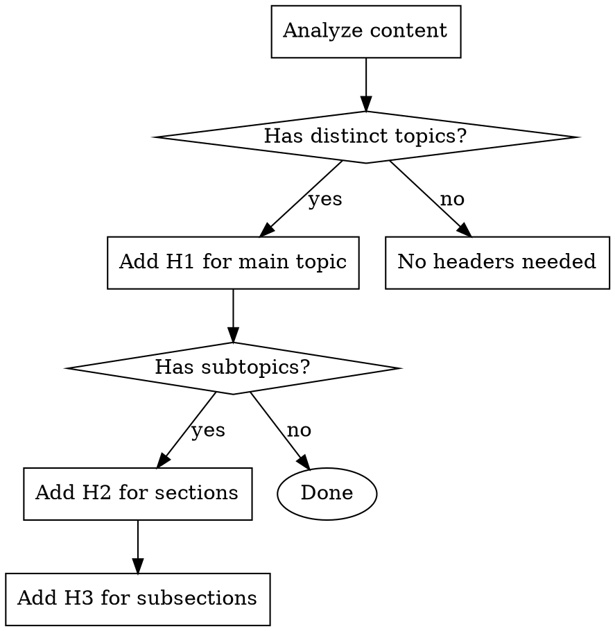
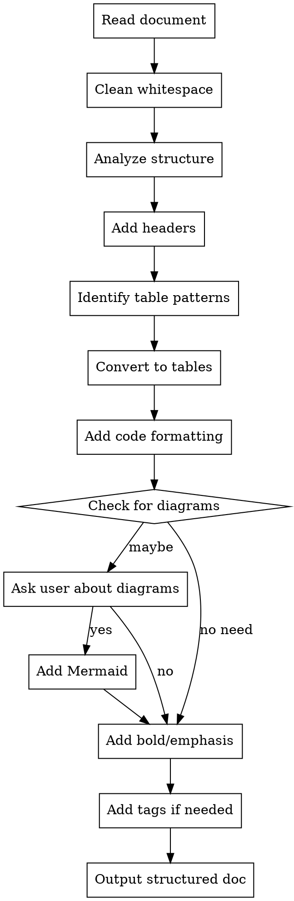
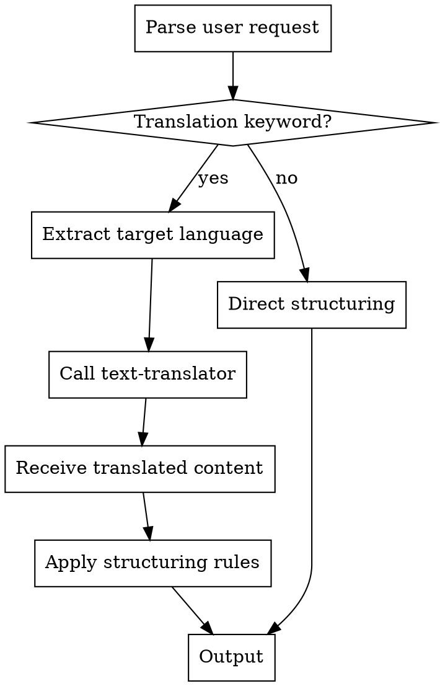
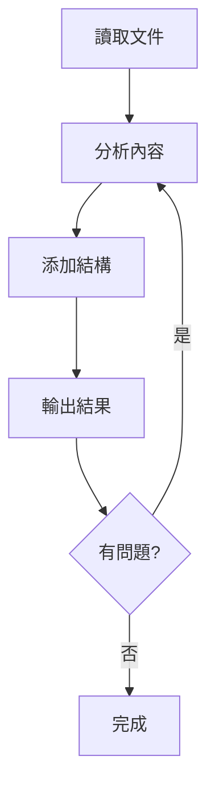

# Markdown Structurer

## Overview

Transform plain or flat narrative text into well-structured Markdown by analyzing content and adding appropriate structural elements (headers, emphasis, tables, code blocks, diagrams, tags). **Core principle:** Add structure based on systematic rules, not intuition.

## When to Use

**Use this skill when:**
- User has plain text that needs Markdown structure
- Content lacks proper heading hierarchy
- Lists or comparisons could be tables
- Process descriptions need flow diagrams
- Technical terms need code formatting
- Content needs tags for categorization

**Do NOT use for:**
- Only cleaning whitespace/spacing (use `markdown-formatter`)
- Already well-structured documents
- Content where user wants minimal markup

## Decision Framework

Follow these systematic rules to decide which structure to add:

### 1. Headers (# ## ###)



**Rules:**
- **H1**: Main document topic (only one)
- **H2**: Major sections (問題, 方法, 結論, etc.)
- **H3**: Subsections within H2
- **Stop at H3**: Deeper nesting hurts readability

**Pattern matching:**
- "方法 1, 2, 3" → H3 headers
- "首先...其次...最後" → H2 or H3 sections
- Emoji markers (🎯, ✅, ⚠️) → Often H2 headers

### 2. Tables

**Create table when content matches these patterns:**

| Pattern | Example | Convert to |
|---------|---------|-----------|
| Numbered lists of methods/strategies | "方法 1: ..., 方法 2: ..." | Comparison table |
| Before/After comparisons | "❌ 錯誤:... ✅ 正確:..." | Two-column table |
| Key-value pairs | "名稱: X, 描述: Y, 用途: Z" | Definition table |
| Multiple attributes per item | Properties, features, specs | Multi-column table |

**Do NOT create table for:**
- Sequential steps (use numbered list)
- Single-column data (use list)
- < 3 rows (not worth table overhead)

**Table quality rules:**
- **NEVER use HTML tags** (`<br>`, `<b>`, etc.) in tables
- If content needs line breaks, restructure as subsections instead of table
- Keep cell content concise (1-2 lines max, < 100 chars per cell)
- For comparisons with >3 attributes per item, use separate subsections with H3 headers

### 3. Code Blocks

**Use code formatting when:**

| Content Type | Format | Example |
|--------------|--------|---------|
| YAML/JSON config | \`\`\`yaml | Skill frontmatter |
| Commands | \`\`\`bash | /context, git commit |
| Technical terms (inline) | \`keywords\` | `description`, `frontmatter` |
| File paths | \`path/to/file\` | `SKILL.md`, `.claude/skills/` |
| Variable names | \`variableName\` | `maxRetries`, `userName` |

**Pattern matching:**
- Starts with `---` and contains `name:` → YAML block
- Starts with `/` or `$` → bash block
- CamelCase or snake_case → inline code

### 4. Mermaid Diagrams

**ALWAYS ask user before adding Mermaid diagrams.**

**When to ask:**
- When you identify ANY workflow, process, or decision logic
- When content contains sequence words (首先...然後...最後)
- When there are conditional statements (如果...則...)
- Even if you're unsure - better to ask

**Question format:**
```
我發現這段內容描述了 [workflow/process/decision]:
[quote relevant text]

是否需要添加 Mermaid 圖表來視覺化？
```

**Only add without asking when:**
- User explicitly requests a diagram
- Document already has diagrams and this is similar

**Add Mermaid when user confirms:**
- Content describes a workflow/process
- Decision tree with if/else logic
- State transitions or lifecycle
- Component relationships

**Placement rules:**
- Put diagram BEFORE or WITHIN the section describing the flow
- NOT in a separate "Resources" section at the end

**Types to use:**
- `graph LR` or `graph TD`: Workflows, processes
- `flowchart`: Decision trees (supports diamond shapes)
- `sequenceDiagram`: Interactions between actors
- `classDiagram`: Object relationships (rare)

### 5. Bold and Emphasis

**Use bold for:**
- **First mention** of key concepts in a section
- **Category labels** (用途:, 注意:, 範例:)
- **Contrasts** (錯誤 vs 正確, Before vs After)

**Do NOT overuse:**
- Not every sentence needs bold
- Not for entire paragraphs
- Not for decoration

### 6. Tags

**Add tags when:**
- Document is reference material (vs narrative)
- Multiple categorization needed
- Searchability is important

**Format:**
```markdown
> **Tags:** `category1` `category2` `category3` `topic`
```

**Placement:** Top of document, after title

## Workflow



### Step-by-Step

1. **Read and clean**
   - Use Read tool to load file
   - Remove redundant whitespace (or call markdown-formatter first)

2. **Add headers**
   - Identify main topic → H1
   - Identify major sections → H2
   - Identify subsections → H3
   - Use pattern matching (方法 1/2/3, emojis)

3. **Tableize content**
   - Look for patterns: numbered items, comparisons, key-value pairs
   - Convert matching patterns to tables
   - Keep sequential steps as lists

4. **Format code**
   - Wrap YAML/JSON in code blocks with language tag
   - Wrap commands in bash blocks
   - Inline code for technical terms, paths, variables

5. **Consider diagrams**
   - Identify process descriptions
   - If obvious workflow → Add Mermaid
   - If unclear → Ask user: "我發現這段內容描述了流程 [quote]。是否需要添加 Mermaid 流程圖？"
   - Place diagram in relevant section, NOT at end

6. **Add emphasis**
   - Bold first mention of key concepts per section
   - Bold category labels
   - Bold contrasts

7. **Add tags**
   - If document is reference/guide → Add tags at top
   - Choose 3-5 relevant categories

8. **Output**
   - Use Edit or Write tool
   - Provide brief summary of changes

## Translation Integration

### Automatic Translation Detection

If user request includes translation keywords, markdown-structurer will automatically call text-translator before applying structure.

**Translation keywords:**
- "翻譯", "translate", "轉成", "convert to"
- Plus target language: "英文", "English", "日本語", etc.

**Workflow when translation detected:**



### Examples

**Example 1: Translation + Structuring**

**User request:**
```
"翻譯成英文並結構化"
```

**Process:**
1. markdown-structurer detects "翻譯" + "英文"
2. Calls text-translator(target=English)
3. Receives English Markdown
4. Applies structuring (headers, tables, etc.)
5. Outputs structured English document

**Example 2: Structuring Only**

**User request:**
```
"請結構化這個文件"
```

**Process:**
1. markdown-structurer finds no translation keywords
2. Skips text-translator
3. Applies structuring directly to original content
4. Outputs structured document in original language

**Example 3: Translation with Language Question**

**User request:**
```
"翻譯並結構化這個文件"
```

**Process:**
1. markdown-structurer detects "翻譯" but no target language
2. Calls text-translator
3. text-translator asks: "要翻譯成什麼語言？"
4. User responds: "英文"
5. Translates to English
6. markdown-structurer applies structure
7. Outputs structured English document

### Benefits

- **Single command:** User gets translation + structure in one request
- **Separation of concerns:** Translation and structuring are separate skills
- **Flexible:** Can use each skill independently
- **Automatic:** No manual chaining needed

## Quick Reference

| Element | When to Add | Pattern to Match |
|---------|-------------|------------------|
| H1 | Main topic | Document title/theme |
| H2 | Major sections | Distinct topic changes, emojis |
| H3 | Subsections | "方法 1/2/3", "步驟 A/B/C" |
| Table | Comparisons, attributes | "❌ vs ✅", numbered methods, key-value |
| Code block | Config, commands | `---` + `name:`, starts with `/` or `$` |
| Inline code | Terms, paths, vars | CamelCase, `file.md`, technical terms |
| Mermaid | Workflows | "首先...然後...最後", decision logic |
| Bold | Key concepts | First mention, labels, contrasts |
| Tags | Reference docs | Guides, references, tutorials |

## Common Mistakes

### ❌ Mistake 1: Everything becomes a table
**Problem:** Converting lists to tables when list format is clearer.

**Example of bad conversion:**
```markdown
# Bad: Unnecessary table
| Step |
|------|
| Read file |
| Process content |
| Write output |
```

**Correct approach:**
```markdown
# Good: Sequential steps as list
1. Read file
2. Process content
3. Write output
```

**Rule:** Only tableize when comparing attributes or showing relationships.

### ❌ Mistake 2: Diagram dumping ground at end
**Problem:** Putting all Mermaid diagrams in "Resources" or "Appendix" section.

**Fix:** Place each diagram in the section describing that process.

### ❌ Mistake 3: Inconsistent code formatting
**Problem:** Sometimes using inline code, sometimes not, for same type of content.

**Example:**
```markdown
Bad: The description field and the `name` field are required.
Good: The `description` field and the `name` field are required.
```

**Fix:** Always use inline code for technical terms, consistently.

### ❌ Mistake 4: Over-bolding
**Problem:** Bolding too many things, losing emphasis.

**Example:**
```markdown
Bad: **This is important** and **this too** and **also this**.
Good: **Key concept:** This is important. The details follow.
```

**Fix:** Bold only first mentions and category labels.

### ❌ Mistake 5: Too many header levels
**Problem:** Using H4, H5, H6, creating deep nesting.

**Fix:** Stop at H3. If you need more levels, restructure the document.

### ❌ Mistake 6: Not asking about diagrams
**Problem:** Adding complex Mermaid diagrams without confirming need.

**Fix:** When process description is found, ask user if diagram is wanted.

### ❌ Mistake 7: Using HTML in tables
**Problem:** Using HTML tags like `<br>` in table cells to force line breaks.

**Bad example:**
```markdown
| 錯誤 | 正確 |
|------|------|
| `description: Help`<br>太籠統 | `description: Refactor code`<br>明確場景 |
```

**Why it's bad:**
- Not pure Markdown
- May not render in all Markdown processors
- Hard to read in source

**Fix:** If content needs line breaks, don't use a table. Use subsections instead:

**Good approach:**
```markdown
### 陷阱 1: Description 太籠統

❌ **錯誤:**
```yaml
description: Help with code
```
會在任何程式碼討論時觸發。

✅ **正確:**
```yaml
description: Refactor code following SOLID principles
```
明確使用場景。
```

## Examples

### Example 1: Plain text about skill creation

**Input:**
```
技巧 1：使用動詞
使用動作動詞可以讓 description 更清楚。常見的動詞包括 create、fix、review。

技巧 2：加入範例
提供具體的用戶語句範例，例如 "review this code" 或 "check my PR"。

技巧 3：避免衝突
確保關鍵字不會和其他 skill 衝突。
```

**Output:**
```markdown
## 技巧

### 技巧 1：使用動詞

使用動作動詞可以讓 `description` 更清楚。常見的動詞包括：

| 類別 | 動詞 |
|------|------|
| 創建 | create, build, make |
| 修復 | fix, resolve, repair |
| 檢查 | review, check, validate |

### 技巧 2：加入範例

提供具體的用戶語句範例，例如：
- "review this code"
- "check my PR"

### 技巧 3：避免衝突

確保關鍵字不會和其他 skill 衝突。
```

**Changes made:**
- Added H2 and H3 headers
- Created table for verb categories
- Used inline code for `description`
- Converted examples to list format

### Example 2: Process description

**Input:**
```
首先讀取文件，然後分析內容，接著添加結構，最後輸出結果。如果發現問題，回到分析步驟。
```

**Agent response:**
"我發現這段內容描述了一個循環流程。是否需要添加 Mermaid 流程圖來視覺化這個過程？"

**If user says yes:**
```markdown
## 處理流程



首先**讀取文件**，然後**分析內容**，接著添加結構，最後輸出結果。如果發現問題，回到分析步驟。
```

## Rationalization Table

| Excuse | Reality |
|--------|---------|
| "I know what looks better" | Use systematic rules, not intuition |
| "User wants it structured, so I'll decide everything" | Ask about diagrams and significant choices |
| "This list is fine" | Check table patterns first (comparisons, attributes) |
| "One table is enough" | Apply rules consistently to all matching patterns |
| "Diagram at end is cleaner" | Diagrams belong in relevant sections |
| "I'll add bold where I think it's important" | Bold first mentions and labels, systematically |
| "Too simple to need structure" | Even simple content benefits from headers and formatting |
| "Table cells need line breaks, so I'll use `<br>`" | NEVER use HTML in tables. If content needs breaks, restructure |
| "Content doesn't fit pattern, so no need to ask about Mermaid" | Ask about ANY workflow/process, even if unsure |
| "I'll only ask if I decide to add diagram" | Ask BEFORE deciding, not after |

## Error Handling

### File Operation Errors

**File not found:**
- Check file path is correct
- Verify file exists with Read tool
- Provide clear error: "File not found at [path]. Please verify the path."

**Permission denied:**
- Check read permissions
- Try with absolute path
- Suggest user to check file permissions: `ls -la [file]`

**File too large:**
- Check file size before processing
- Warn if > 10MB: "Large file detected. Processing may take longer."
- Consider processing in chunks for very large files

### Content Processing Errors

**Invalid Markdown:**
- Don't fail on malformed Markdown
- Process what's parsable
- Note issues in output: "Note: Original file had formatting issues at line X"

**Encoding issues:**
- Assume UTF-8 by default
- Detect encoding if possible
- Provide clear error if encoding fails: "Unable to parse file. Please ensure UTF-8 encoding."

**Empty or minimal content:**
- If file is empty: "File is empty. Nothing to structure."
- If < 3 lines: "Content too minimal for structural analysis."

### User Input Errors

**Invalid requests:**
- If user asks for unsupported structure: "That structure type is not supported. Supported: headers, tables, code blocks, diagrams, tags."
- If contradictory preferences: Ask for clarification

**Missing context:**
- If unclear what to structure: Ask for file path or content
- If multiple files: Ask which to process

### Graceful Degradation

**If analysis fails:**
- Fall back to basic formatting (headers only)
- Inform user: "Advanced analysis unavailable. Applied basic structure only."

**If tool unavailable:**
- If Edit/Write fails: Provide structured content as output for user to copy
- If Read fails: Ask user to provide content directly

## Security Considerations

### Input Validation
- Validate file paths to prevent directory traversal
- Check file size before processing (max 10MB recommended)
- Sanitize user input in prompts

### Safe Operations
- Read-only by default
- Confirm before overwriting files
- Don't execute embedded code in Markdown

### XSS Prevention
- Escape HTML entities if rendering to web
- Don't interpret user content as commands
- Sanitize Mermaid diagram syntax (no script injection)

## Integration with Other Skills

**Workflow with markdown-formatter:**
1. User: "整理並結構化這個文件"
2. Run markdown-formatter first (clean whitespace)
3. Then run markdown-structurer (add structure)
4. Result: Clean and well-structured document

**Standalone:**
1. User: "把這段純文字轉成有結構的 Markdown"
2. Run markdown-structurer directly
3. Includes basic cleanup as part of workflow

## Implementation Notes

This skill focuses on **content analysis and structural enrichment**, while `markdown-formatter` focuses on **whitespace and spacing**. They complement each other but can work independently.
