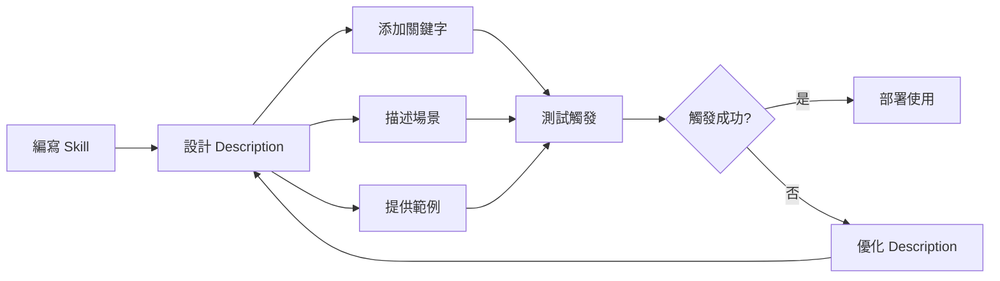

# 如何保證 Skill 能被 AI 調用？

> **Tags:** `claude-skills` `best-practices` `skill-development` `trigger-optimization`

## 簡短答案

沒有專門的 `keywords` 欄位，但你應該在 **description** 中明確寫出關鍵字和觸發場景。

---

## ✅ 最佳實踐：在 Description 中寫關鍵字

### 策略 1：直接列出觸發關鍵字

```yaml
---
name: deploy-production
description: Deploy application to production environment. Keywords: deploy, push to production, release, go live
disable-model-invocation: true
---
```

### 策略 2：描述使用時機（推薦）⭐

```yaml
---
name: create-api-endpoint
description: Create a new REST API endpoint following project conventions. Use when user asks to "create an endpoint", "add API route", "build new API", or "make a GET/POST endpoint"
---
```

### 策略 3：包含範例語句

```yaml
---
name: fix-github-issue
description: Fix a GitHub issue and create PR. Use when user says "fix issue #123", "resolve bug 456", or "implement feature request"
argument-hint: [issue-number]
---
```

### 策略 4：組合方式（最推薦）⭐⭐

```yaml
---
name: code-review
description: |
  Perform comprehensive code review following team standards.

  **Use when:**
  - User asks to "review this code"
  - "Check my implementation"
  - "Is this code good?"
  - "Review my PR"

  **Keywords:** review, check, validate, audit, inspect, evaluate
---
```

---

## 🎯 提高觸發率的技巧

### 1. 使用動詞 + 名詞組合

```yaml
description: Create git commit with conventional commit message. Triggers: commit, create commit, save changes, commit code
```

**常見動詞：**

| 類別 | 動詞 |
|------|------|
| 創建 | create, build, make, add |
| 修復 | fix, resolve, repair |
| 檢查 | review, check, validate |
| 部署 | deploy, push, release |
| 分析 | analyze, investigate, explore |

### 2. 包含同義詞

```yaml
description: Deploy application (synonyms: push, release, ship, publish, launch to production)
```

### 3. 列出常見錯誤表達

```yaml
description: |
  Fix TypeScript errors and type issues.
  Use when user mentions: "TS error", "type error", "TypeScript complaining", "red squiggly lines", "type mismatch"
```

### 4. 使用結構化格式

```yaml
description: |
  Generate comprehensive README documentation.

  Triggers on:
  - "create README"
  - "write documentation"
  - "generate docs"
  - "need a README file"

  Best for: new projects, open source repos, documentation updates
```

---

## 📊 Description 結構模板

### 模板 A：簡潔版

```
description: [Action] [Object]. Use when [scenario]. Keywords: [key1, key2, key3]
```

**範例：**
```yaml
description: Create React component following design system. Use when building UI components. Keywords: component, create component, new component, React component
```

### 模板 B：完整版

```yaml
description: |
  [一句話概述]

  **Use when:**
  - [場景 1]
  - [場景 2]

  **Triggers:**
  - "[用戶語句 1]"
  - "[用戶語句 2]"

  **Keywords:** [關鍵字列表]
```

**範例：**
```yaml
description: |
  Review pull request and provide structured feedback.

  **Use when:**
  - User provides PR number or URL
  - User asks for code review
  - Before merging to main branch

  **Triggers:**
  - "review PR #123"
  - "check this pull request"
  - "feedback on my code"

  **Keywords:** review, PR, pull request, code review, feedback
```

---

## 🔍 驗證 Skill 可被觸發

### 方法 1：使用 `/context` 檢查

```bash
/context
```

**查看輸出：**
- ✅ Skill description 出現在 "Available skills" 區塊
- ❌ Skill 出現在 "Excluded skills"（超過字元預算）

### 方法 2：測試觸發

**說出 description 中的關鍵字：**

```
你：「幫我 review 這段 code」
→ 如果 description 包含 "review" 和 "code"，應該會觸發
```

### 方法 3：直接呼叫確認功能

```bash
/skill-name
```

先確保 Skill 本身功能正常，再測試自動觸發。

---

## ⚠️ 常見陷阱

### 陷阱 1：Description 太籠統

❌ **錯誤：會在任何程式碼討論時觸發**
```yaml
description: Help with code
```

✅ **正確：明確使用場景**
```yaml
description: Refactor code following SOLID principles. Use when user explicitly asks to "refactor" or "improve code structure"
```

### 陷阱 2：只有關鍵字沒有上下文

❌ **錯誤：Claude 不知道何時用**
```yaml
description: Keywords: deploy, push, release
```

✅ **正確：關鍵字 + 使用場景**
```yaml
description: Deploy to production. Use when tests pass and user confirms ready to deploy. Keywords: deploy, push to prod, go live
```

### 陷阱 3：關鍵字與其他 Skill 衝突

❌ **如果有多個 Skill 都用 "review"**
```yaml
skill-1: description: Review code
skill-2: description: Review documentation
```

✅ **使用更具體的關鍵字**
```yaml
skill-1: description: Review source code implementation for bugs and best practices. Keywords: code review, PR review
skill-2: description: Review technical documentation for clarity and completeness. Keywords: docs review, documentation check
```

---

## 🎓 進階技巧

### 技巧 1：使用否定關鍵字（在內容中說明）

```yaml
---
name: quick-fix
description: Quick bug fixes for simple issues. Use for minor bugs, typos, small changes
---
This skill is for QUICK fixes only.
Do NOT use for:
- Major refactoring
- Architectural changes
- Breaking changes
```

### 技巧 2：優先級提示

```yaml
description: |
  Primary test runner for the project.
  **Use this FIRST when user asks to run tests.**
  Keywords: test, run tests, execute tests, test suite
```

### 技巧 3：條件觸發

```yaml
description: |
  Deploy to staging environment.
  Use when user mentions "staging" OR "test environment" (but NOT "production").
  Keywords: staging, deploy staging, push to staging
```

---

## 📋 Description 檢查清單

建立 description 時檢查：

- [ ] 一句話概述 Skill 的功能
- [ ] 包含 3-5 個核心關鍵字
- [ ] 列出 2-3 個使用場景（"Use when..."）
- [ ] 包含範例用戶語句（"like '...'", "mentions '...'"）
- [ ] 避免與其他 Skill 的關鍵字衝突
- [ ] Description 長度適中（50-200 字元為佳）
- [ ] 使用主動語態和動作動詞

---

## 💡 總結

雖然沒有專門的 `keywords` 欄位，但通過在 `description` 中：

| 策略 | 效果 |
|------|------|
| ✅ 明確列出關鍵字 | 提高精準匹配率 |
| ✅ 描述使用場景 | 讓 AI 理解上下文 |
| ✅ 提供範例語句 | 捕捉自然語言變化 |
| ✅ 包含同義詞 | 擴大觸發範圍 |

**可以大幅提高 Skill 被正確觸發的機率！**

---

## 相關資源


